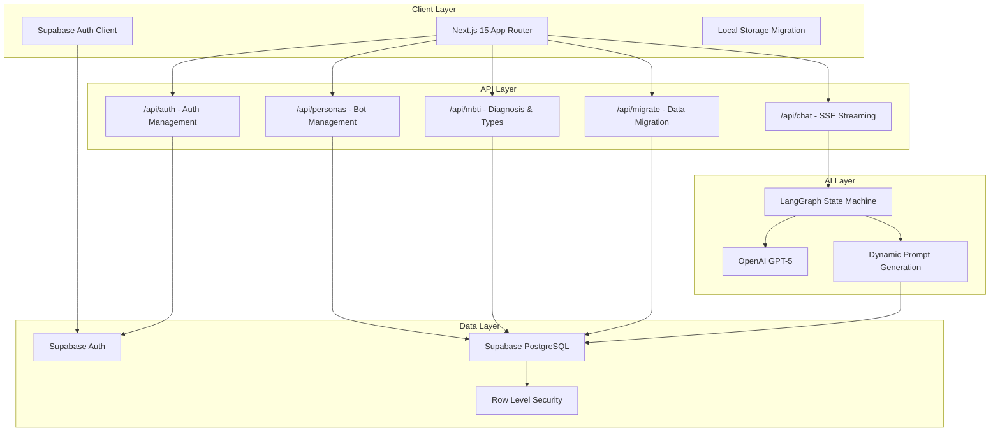
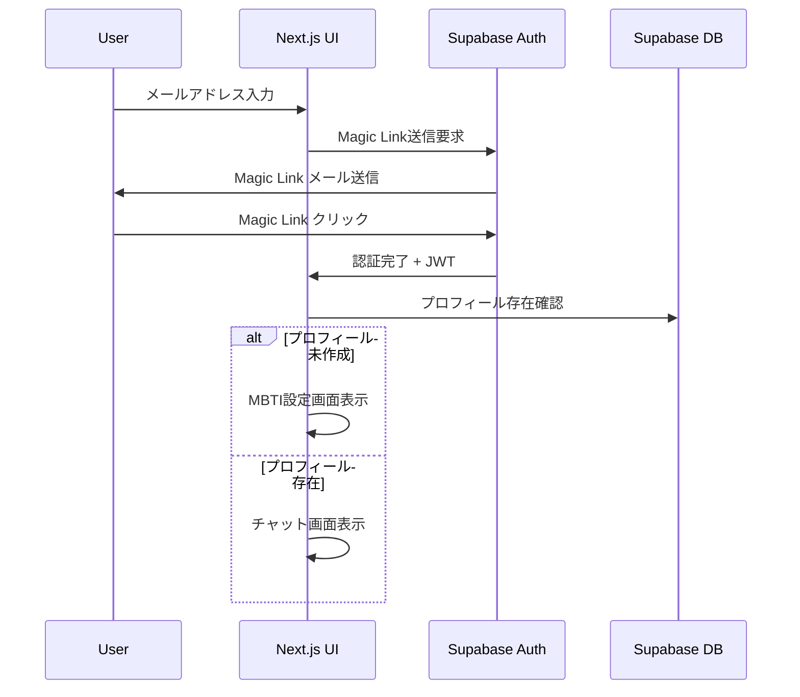
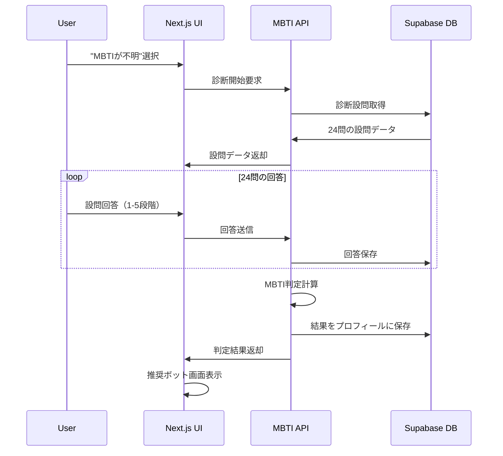
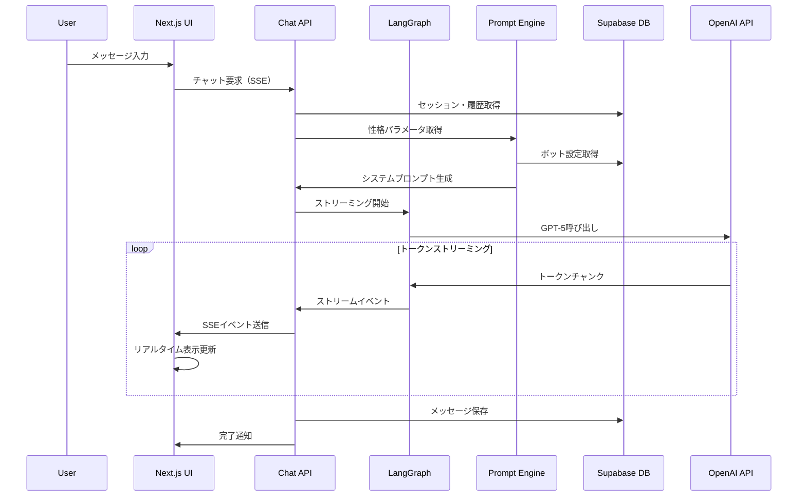
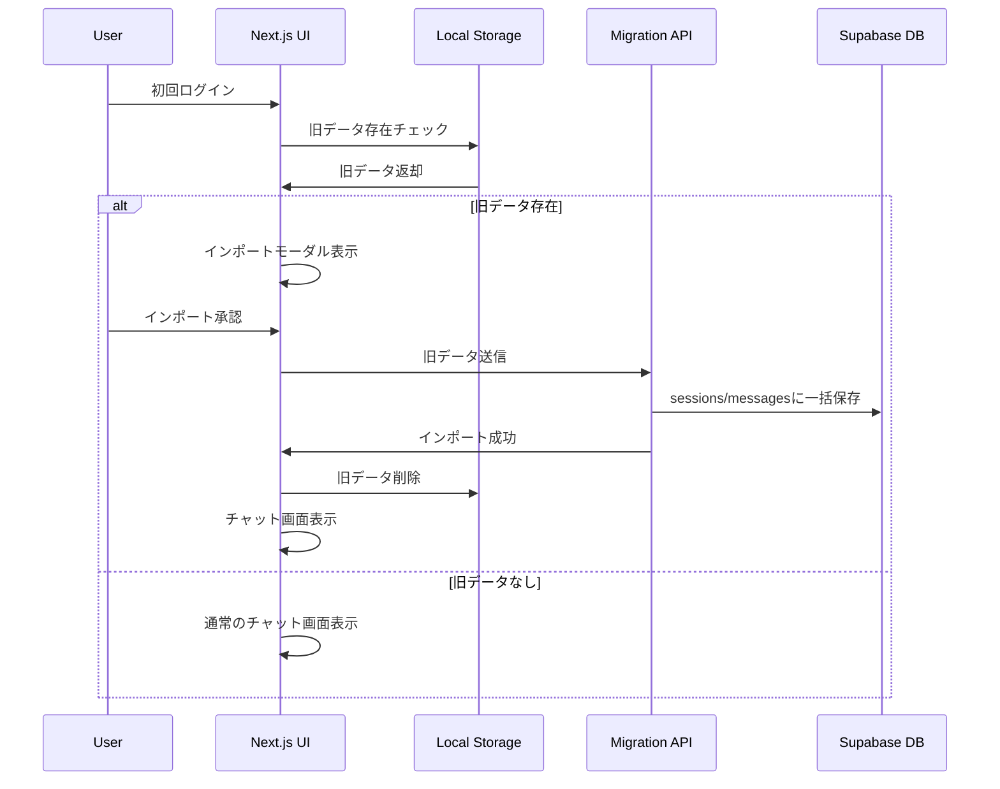

# MBTI チャットボットシステム 設計書

## 概要

本設計書は、MBTI（Myers-Briggs Type Indicator）を活用したパーソナライズドチャットボットシステムのMVPの技術設計を定義します。現在のNext.js + LangGraphベースのチャットシステムを拡張し、Supabaseによるユーザー認証・データ永続化、MBTI診断機能、性格パラメータベースのボットカスタマイズ機能、ローカルデータ移行機能を追加します。GPT-5とLangGraphによるリアルタイムストリーミングで自然な対話体験を実現します。

## アーキテクチャ

### システム全体構成



### データフロー設計

#### 1. ユーザー認証フロー


#### 2. MBTI診断フロー


#### 3. チャットストリーミングフロー


#### 4. ローカルデータ移行フロー


## コンポーネントとインターフェース

### フロントエンドコンポーネント構造

```
src/
├── app/
│   ├── (auth)/
│   │   ├── login/
│   │   │   └── page.tsx              # ログイン画面
│   │   ├── signup/
│   │   │   └── page.tsx              # サインアップ画面
│   │   └── profile/
│   │       └── page.tsx              # プロフィール設定
│   ├── (dashboard)/
│   │   ├── chat/
│   │   │   └── page.tsx              # メインチャット画面
│   │   ├── personas/
│   │   │   └── page.tsx              # ボット管理画面
│   │   └── settings/
│   │       └── page.tsx              # 設定画面
│   ├── mbti/
│   │   ├── diagnosis/
│   │   │   └── page.tsx              # MBTI診断画面
│   │   └── result/
│   │       └── page.tsx              # 診断結果画面
│   └── api/
│       ├── auth/
│       │   └── route.ts              # 認証API
│       ├── chat/
│       │   └── route.ts              # チャットAPI（既存拡張）
│       ├── personas/
│       │   └── route.ts              # ボット管理API
│       ├── mbti/
│       │   ├── diagnosis/
│       │   │   └── route.ts          # 診断API
│       │   └── types/
│       │       └── route.ts          # MBTIタイプAPI
│       └── migrate/
│           └── route.ts              # データ移行API
├── components/
│   ├── auth/
│   │   ├── AuthProvider.tsx          # 認証プロバイダー
│   │   ├── LoginForm.tsx             # ログインフォーム
│   │   └── ProtectedRoute.tsx        # 認証ガード
│   ├── mbti/
│   │   ├── DiagnosisForm.tsx         # 診断フォーム
│   │   ├── TypeSelector.tsx          # タイプ選択
│   │   └── RecommendationCard.tsx    # 推奨ボット表示
│   ├── personas/
│   │   ├── PersonaEditor.tsx         # 性格パラメータエディタ
│   │   ├── PersonaList.tsx           # ボット一覧
│   │   └── ParameterSlider.tsx       # パラメータスライダー
│   ├── chat/
│   │   ├── Chat.tsx                  # メインチャット（既存拡張）
│   │   ├── SessionManager.tsx        # セッション管理
│   │   └── MessageBubble.tsx         # メッセージ表示
│   ├── migration/
│   │   ├── ImportModal.tsx           # データインポートモーダル
│   │   └── MigrationStatus.tsx       # 移行状況表示
│   └── i18n/
│       ├── LanguageProvider.tsx      # 多言語プロバイダー
│       └── LanguageToggle.tsx        # 言語切替
├── lib/
│   ├── supabase/
│   │   ├── client.ts                 # Supabaseクライアント
│   │   ├── auth.ts                   # 認証ヘルパー
│   │   └── database.types.ts         # DB型定義
│   ├── mbti/
│   │   ├── calculator.ts             # MBTI判定ロジック
│   │   ├── recommendations.ts        # 推奨アルゴリズム
│   │   └── questions.ts              # 診断設問データ
│   ├── personas/
│   │   ├── templates.ts              # プロンプトテンプレート
│   │   └── parameters.ts             # パラメータ定義
│   └── i18n/
│       ├── config.ts                 # 多言語設定
│       ├── translations/
│       │   ├── ja.json               # 日本語翻訳
│       │   └── en.json               # 英語翻訳
│       └── hooks.ts                  # 多言語フック
```

### APIインターフェース設計

#### 1. 認証API (`/api/auth`)
```typescript
// POST /api/auth/signup
interface SignupRequest {
  email: string;
  language?: 'ja' | 'en';
}

interface SignupResponse {
  success: boolean;
  message: string;
}

// POST /api/auth/profile
interface ProfileRequest {
  mbti?: string;
  language?: 'ja' | 'en';
}

interface ProfileResponse {
  id: string;
  email: string;
  mbti: string | null;
  language: 'ja' | 'en';
  created_at: string;
  updated_at: string;
}
```

#### 2. MBTI診断API (`/api/mbti`)
```typescript
// GET /api/mbti/questions
interface Question {
  id: string;
  axis: 'EI' | 'SN' | 'TF' | 'JP';
  prompt: string;
  polarity: 1 | -1;
}

interface QuestionsResponse {
  questions: Question[];
}

// POST /api/mbti/diagnosis
interface DiagnosisRequest {
  answers: Array<{
    question_id: string;
    score: -2 | -1 | 0 | 1 | 2;
  }>;
}

interface DiagnosisResponse {
  mbti_type: string;
  scores: {
    EI: number;
    SN: number;
    TF: number;
    JP: number;
  };
}
```

#### 3. ボット管理API (`/api/personas`)
```typescript
// GET /api/personas
interface PersonaResponse {
  id: string;
  name: string;
  mbti: string | null;
  owner_id: string | null;
  params: PersonalityParameters;
  system_template: string;
  created_at: string;
}

// POST /api/personas
interface CreatePersonaRequest {
  name: string;
  mbti?: string;
  params: PersonalityParameters;
  system_template?: string;
}

// GET /api/personas/recommendations
interface RecommendationResponse {
  recommendations: Array<{
    persona: PersonaResponse;
    compatibility_score: number;
    reason: string;
  }>;
}
```

#### 4. 拡張チャットAPI (`/api/chat`)
```typescript
// 既存のチャットAPIを拡張
interface ChatRequest {
  messages: Message[];
  systemPrompt?: string;
  personaId?: string;           // 新規追加
  sessionId?: string;           // 新規追加
  overrideParams?: Partial<PersonalityParameters>; // 新規追加
}

// SSEイベント型も拡張
type SSEEvent = 
  | { type: "token", text: string }
  | { type: "error", message: string }
  | { type: "done" }
  | { type: "progress", node: string }     // 新規追加
  | { type: "usage", tokens_out: number }  // 新規追加
```

#### 5. データ移行API (`/api/migrate`)
```typescript
// POST /api/migrate
interface MigrationRequest {
  sessions: Array<{
    id: string;
    title: string;
    messages: Array<{
      role: 'user' | 'assistant' | 'system';
      content: string;
      timestamp: string;
    }>;
    created_at: string;
  }>;
}

interface MigrationResponse {
  success: boolean;
  imported_sessions: number;
  imported_messages: number;
  errors?: string[];
}

// GET /api/migrate/check
interface MigrationCheckResponse {
  has_legacy_data: boolean;
  session_count: number;
  message_count: number;
}
```

## データモデル

### Supabaseデータベーススキーマ

このプロジェクトでは、以下のPostgreSQL拡張・ENUM型・テーブル群・関数・RLSを採用します。提示のスキーマはSupabase標準の`auth.users`と連携し、厳格なRLSでセキュリティを担保します。

#### 0) 拡張
```sql
create extension if not exists pgcrypto;
create extension if not exists citext;
```

#### 1) ENUM 型
```sql
do $$
begin
  if not exists (select 1 from pg_type where typname = 'mbti_code') then
    create type mbti_code as enum (
      'INTJ','INTP','ENTJ','ENTP','INFJ','INFP','ENFJ','ENFP',
      'ISTJ','ISFJ','ESTJ','ESFJ','ISTP','ISFP','ESTP','ESFP'
    );
  end if;

  if not exists (select 1 from pg_type where typname = 'message_role') then
    create type message_role as enum ('user','assistant','system','tool');
  end if;

  if not exists (select 1 from pg_type where typname = 'session_status') then
    create type session_status as enum ('active','archived');
  end if;

  if not exists (select 1 from pg_type where typname = 'visibility') then
    create type visibility as enum ('private','public');
  end if;

  if not exists (select 1 from pg_type where typname = 'role_type') then
    create type role_type as enum ('user','admin');
  end if;

  if not exists (select 1 from pg_type where typname = 'mbti_axis') then
    create type mbti_axis as enum ('EI','SN','TF','JP');
  end if;
end $$;
```

#### 2) ユーティリティ関数
```sql
create or replace function set_updated_at()
returns trigger language plpgsql as $$
begin
  new.updated_at := now();
  return new;
end $$;
```

#### 3) プロフィール / 役割テーブル
```sql
create table if not exists profiles (
  id            uuid primary key references auth.users(id) on delete cascade,
  handle        citext unique,
  display_name  text,
  avatar_url    text,
  mbti_type     mbti_code,
  bio           text,
  preferences   jsonb not null default '{}',
  is_public     boolean not null default false,
  last_seen_at  timestamptz,
  created_at    timestamptz not null default now(),
  updated_at    timestamptz not null default now()
);
drop trigger if exists trg_profiles_updated_at on profiles;
create trigger trg_profiles_updated_at
before update on profiles
for each row execute function set_updated_at();

create table if not exists user_roles (
  user_id   uuid not null references auth.users(id) on delete cascade,
  role      role_type not null,
  created_at timestamptz not null default now(),
  primary key (user_id, role)
);
```

#### 4) 管理者判定関数（SECURITY DEFINER）
```sql
drop function if exists is_admin();
create or replace function is_admin()
returns boolean
security definer
set search_path = public
stable
language sql
as $$
  select exists (
    select 1 from user_roles
    where user_id = auth.uid() and role = 'admin'
  );
$$;
revoke all on function is_admin() from public;
grant execute on function is_admin() to authenticated;
-- 必要なら anon にも: grant execute on function is_admin() to anon;
```

#### 5) ボット・ペルソナ
```sql
create table if not exists bot_personas (
  id            uuid primary key default gen_random_uuid(),
  owner_id      uuid references auth.users(id) on delete set null, -- null=プリセット
  name          text not null,
  description   text,
  mbti_type     mbti_code,
  warmth        smallint not null default 50 check (warmth between 0 and 100),
  formality     smallint not null default 50 check (formality between 0 and 100),
  brevity       smallint not null default 50 check (brevity between 0 and 100),
  humor         smallint not null default 50 check (humor between 0 and 100),
  empathy       smallint not null default 50 check (empathy between 0 and 100),
  assertiveness smallint not null default 50 check (assertiveness between 0 and 100),
  creativity    smallint not null default 50 check (creativity between 0 and 100),
  rigor         smallint not null default 50 check (rigor between 0 and 100),
  emoji_usage   smallint not null default 25 check (emoji_usage between 0 and 100),
  steps         smallint not null default 1  check (steps between 1 and 20),
  visibility    visibility not null default 'private',
  system_prompt_template text,
  version       integer not null default 1,
  created_at    timestamptz not null default now(),
  updated_at    timestamptz not null default now()
);
create index if not exists idx_bot_personas_owner on bot_personas(owner_id);
create index if not exists idx_bot_personas_visibility on bot_personas(visibility);
drop trigger if exists trg_bot_personas_updated_at on bot_personas;
create trigger trg_bot_personas_updated_at
before update on bot_personas
for each row execute function set_updated_at();
```

#### 6) セッション / メッセージ / フィードバック
```sql
create table if not exists sessions (
  id             uuid primary key default gen_random_uuid(),
  user_id        uuid not null references auth.users(id) on delete cascade,
  persona_id     uuid references bot_personas(id) on delete set null,
  title          text,
  model          text,
  temperature    numeric(3,2) not null default 0.70 check (temperature between 0 and 2),
  status         session_status not null default 'active',
  message_count  integer not null default 0,
  last_message_at timestamptz,
  created_at     timestamptz not null default now(),
  updated_at     timestamptz not null default now(),
  deleted_at     timestamptz
);
create index if not exists idx_sessions_user_created on sessions(user_id, created_at desc);
create index if not exists idx_sessions_persona on sessions(persona_id);
drop trigger if exists trg_sessions_updated_at on sessions;
create trigger trg_sessions_updated_at
before update on sessions
for each row execute function set_updated_at();

create table if not exists messages (
  id                uuid primary key default gen_random_uuid(),
  session_id        uuid not null references sessions(id) on delete cascade,
  role              message_role not null,
  content           text not null,
  content_json      jsonb,
  model             text,
  tokens_prompt     integer,
  tokens_completion integer,
  error             text,
  created_at        timestamptz not null default now()
);
create index if not exists idx_messages_session_created on messages(session_id, created_at);
create index if not exists idx_messages_session_id on messages(session_id, id);

create or replace function bump_session_on_message()
returns trigger language plpgsql as $$
begin
  update sessions
     set message_count = message_count + 1,
         last_message_at = now(),
         updated_at = now()
   where id = new.session_id;
  return new;
end $$;
drop trigger if exists trg_messages_after_insert on messages;
create trigger trg_messages_after_insert
after insert on messages
for each row execute function bump_session_on_message();

create table if not exists message_feedback (
  id         uuid primary key default gen_random_uuid(),
  message_id uuid not null references messages(id) on delete cascade,
  user_id    uuid not null references auth.users(id) on delete cascade,
  rating     smallint not null check (rating in (-1, 1)),
  reason     text,
  created_at timestamptz not null default now(),
  unique (message_id, user_id)
);
```

#### 7) MBTI（質問・受検・回答・相性）
```sql
create table if not exists mbti_questions (
  id         uuid primary key default gen_random_uuid(),
  code       text unique,
  text       text not null,
  axis       mbti_axis not null,
  direction  smallint not null default 1 check (direction in (-1, 1)),
  "order"    integer not null,
  locale     text not null default 'ja',
  is_active  boolean not null default true,
  created_at timestamptz not null default now(),
  updated_at timestamptz not null default now()
);
drop trigger if exists trg_mbti_questions_updated_at on mbti_questions;
create trigger trg_mbti_questions_updated_at
before update on mbti_questions
for each row execute function set_updated_at();

create table if not exists mbti_tests (
  id              uuid primary key default gen_random_uuid(),
  user_id         uuid not null references auth.users(id) on delete cascade,
  started_at      timestamptz not null default now(),
  completed_at    timestamptz,
  status          text not null default 'in_progress',
  determined_type mbti_code,
  scores          jsonb,
  created_at      timestamptz not null default now(),
  updated_at      timestamptz not null default now()
);
create index if not exists idx_mbti_tests_user_created on mbti_tests(user_id, created_at desc);
drop trigger if exists trg_mbti_tests_updated_at on mbti_tests;
create trigger trg_mbti_tests_updated_at
before update on mbti_tests
for each row execute function set_updated_at();

create table if not exists mbti_answers (
  id           uuid primary key default gen_random_uuid(),
  test_id      uuid not null references mbti_tests(id) on delete cascade,
  question_id  uuid not null references mbti_questions(id) on delete restrict,
  score        smallint not null check (score between 1 and 7),
  created_at   timestamptz not null default now(),
  unique (test_id, question_id)
);
create index if not exists idx_mbti_answers_test on mbti_answers(test_id);

create table if not exists mbti_compatibilities (
  type_a mbti_code not null,
  type_b mbti_code not null,
  score  smallint not null check (score between 0 and 100),
  primary key (type_a, type_b)
);
```

#### 8) SSE/ストリーミング監査ログ
```sql
create table if not exists sse_events (
  id          uuid primary key default gen_random_uuid(),
  user_id     uuid not null references auth.users(id) on delete cascade,
  session_id  uuid references sessions(id) on delete set null,
  event_type  text not null check (event_type in ('start','end','interrupt','error')),
  detail      text,
  request_id  text,
  created_at  timestamptz not null default now()
);
create index if not exists idx_sse_events_user_created on sse_events(user_id, created_at desc);
```

#### 9) RPC（クライアント用安全投稿）
```sql
create or replace function post_user_message(p_session_id uuid, p_content text)
returns uuid
language plpgsql
as $$
declare
  new_id uuid;
begin
  insert into messages (id, session_id, role, content)
  values (gen_random_uuid(), p_session_id, 'user', p_content)
  returning id into new_id;
  return new_id;
end $$;
grant execute on function post_user_message(uuid, text) to authenticated;
```

### Row Level Security (RLS) ポリシー

#### 10) RLS 有効化
```sql
alter table profiles enable row level security;
alter table user_roles enable row level security;
alter table bot_personas enable row level security;
alter table sessions enable row level security;
alter table messages enable row level security;
alter table message_feedback enable row level security;
alter table mbti_questions enable row level security;
alter table mbti_tests enable row level security;
alter table mbti_answers enable row level security;
alter table mbti_compatibilities enable row level security;
alter table sse_events enable row level security;
```

#### 11) RLS ポリシー
```sql
-- profiles
drop policy if exists "profiles_select_owner_or_public" on profiles;
create policy "profiles_select_owner_or_public"
on profiles
for select
to authenticated
using ( id = auth.uid() or is_public );

drop policy if exists "profiles_update_owner" on profiles;
create policy "profiles_update_owner"
on profiles
for update
to authenticated
using ( id = auth.uid() )
with check ( id = auth.uid() );

drop policy if exists "profiles_insert_self" on profiles;
create policy "profiles_insert_self"
on profiles
for insert
to authenticated
with check ( id = auth.uid() );

drop policy if exists "profiles_admin_select_all" on profiles;
create policy "profiles_admin_select_all"
on profiles
for select
to authenticated
using ( is_admin() );

-- user_roles（通常は不可視、管理者のみ読取）
drop policy if exists "user_roles_admin_read" on user_roles;
create policy "user_roles_admin_read"
on user_roles
for select
to authenticated
using ( is_admin() );

-- bot_personas
drop policy if exists "bot_personas_select_public_or_owner" on bot_personas;
create policy "bot_personas_select_public_or_owner"
on bot_personas
for select
to authenticated
using ( visibility = 'public' or owner_id = auth.uid() );

drop policy if exists "bot_personas_insert_owner" on bot_personas;
create policy "bot_personas_insert_owner"
on bot_personas
for insert
to authenticated
with check ( owner_id = auth.uid() );

drop policy if exists "bot_personas_update_owner" on bot_personas;
create policy "bot_personas_update_owner"
on bot_personas
for update
to authenticated
using ( owner_id = auth.uid() )
with check ( owner_id = auth.uid() );

drop policy if exists "bot_personas_delete_owner" on bot_personas;
create policy "bot_personas_delete_owner"
on bot_personas
for delete
to authenticated
using ( owner_id = auth.uid() );

drop policy if exists "bot_personas_admin_all" on bot_personas;
create policy "bot_personas_admin_all"
on bot_personas
for all
to authenticated
using ( is_admin() )
with check ( is_admin() );

-- sessions
drop policy if exists "sessions_select_owner" on sessions;
create policy "sessions_select_owner"
on sessions
for select
to authenticated
using ( user_id = auth.uid() );

drop policy if exists "sessions_insert_owner" on sessions;
create policy "sessions_insert_owner"
on sessions
for insert
to authenticated
with check ( user_id = auth.uid() );

drop policy if exists "sessions_update_owner" on sessions;
create policy "sessions_update_owner"
on sessions
for update
to authenticated
using ( user_id = auth.uid() )
with check ( user_id = auth.uid() );

drop policy if exists "sessions_delete_owner" on sessions;
create policy "sessions_delete_owner"
on sessions
for delete
to authenticated
using ( user_id = auth.uid() );

-- messages
drop policy if exists "messages_select_session_owner" on messages;
create policy "messages_select_session_owner"
on messages
for select
to authenticated
using (
  exists (
    select 1 from sessions s
    where s.id = session_id and s.user_id = auth.uid()
  )
);

drop policy if exists "messages_insert_user_role_only" on messages;
create policy "messages_insert_user_role_only"
on messages
for insert
to authenticated
with check (
  role = 'user' and
  exists (
    select 1 from sessions s
    where s.id = session_id and s.user_id = auth.uid()
  )
);
-- assistant/system の書込は server 側（service_role）専用

-- message_feedback
drop policy if exists "message_feedback_rw_owner" on message_feedback;
create policy "message_feedback_rw_owner"
on message_feedback
for select
to authenticated
using ( user_id = auth.uid() );

drop policy if exists "message_feedback_insert_owner" on message_feedback;
create policy "message_feedback_insert_owner"
on message_feedback
for insert
to authenticated
with check ( user_id = auth.uid() );

-- mbti_questions / mbti_compatibilities
drop policy if exists "mbti_questions_select_all" on mbti_questions;
create policy "mbti_questions_select_all"
on mbti_questions
for select
to authenticated
using ( true );

drop policy if exists "mbti_questions_admin_write" on mbti_questions;
create policy "mbti_questions_admin_write"
on mbti_questions
for all
to authenticated
using ( is_admin() )
with check ( is_admin() );

drop policy if exists "mbti_compat_select_all" on mbti_compatibilities;
create policy "mbti_compat_select_all"
on mbti_compatibilities
for select
to authenticated
using ( true );

drop policy if exists "mbti_compat_admin_write" on mbti_compatibilities;
create policy "mbti_compat_admin_write"
on mbti_compatibilities
for all
to authenticated
using ( is_admin() )
with check ( is_admin() );

-- mbti_tests / mbti_answers
drop policy if exists "mbti_tests_rw_owner" on mbti_tests;
create policy "mbti_tests_rw_owner"
on mbti_tests
for select
to authenticated
using ( user_id = auth.uid() );

drop policy if exists "mbti_tests_insert_owner" on mbti_tests;
create policy "mbti_tests_insert_owner"
on mbti_tests
for insert
to authenticated
with check ( user_id = auth.uid() );

drop policy if exists "mbti_tests_update_owner" on mbti_tests;
create policy "mbti_tests_update_owner"
on mbti_tests
for update
to authenticated
using ( user_id = auth.uid() )
with check ( user_id = auth.uid() );

drop policy if exists "mbti_answers_rw_owner" on mbti_answers;
create policy "mbti_answers_rw_owner"
on mbti_answers
for select
to authenticated
using (
  exists (
    select 1 from mbti_tests t
    where t.id = test_id and t.user_id = auth.uid()
  )
);

drop policy if exists "mbti_answers_insert_owner" on mbti_answers;
create policy "mbti_answers_insert_owner"
on mbti_answers
for insert
to authenticated
with check (
  exists (
    select 1 from mbti_tests t
    where t.id = test_id and t.user_id = auth.uid()
  )
);

-- sse_events
drop policy if exists "sse_events_select_owner" on sse_events;
create policy "sse_events_select_owner"
on sse_events
for select
to authenticated
using ( user_id = auth.uid() );

drop policy if exists "sse_events_insert_owner" on sse_events;
create policy "sse_events_insert_owner"
on sse_events
for insert
to authenticated
with check ( user_id = auth.uid() );

drop policy if exists "sse_events_admin_read_all" on sse_events;
create policy "sse_events_admin_read_all"
on sse_events
for select
to authenticated
using ( is_admin() );
```

## エラーハンドリング

### エラー分類と対応戦略

#### 1. 認証エラー
```typescript
enum AuthError {
  INVALID_EMAIL = 'INVALID_EMAIL',
  MAGIC_LINK_EXPIRED = 'MAGIC_LINK_EXPIRED',
  UNAUTHORIZED = 'UNAUTHORIZED',
  PROFILE_NOT_FOUND = 'PROFILE_NOT_FOUND'
}

// エラーハンドリング例
const handleAuthError = (error: AuthError, language: 'ja' | 'en') => {
  const messages = {
    ja: {
      [AuthError.INVALID_EMAIL]: 'メールアドレスが無効です',
      [AuthError.MAGIC_LINK_EXPIRED]: 'マジックリンクの有効期限が切れています',
      [AuthError.UNAUTHORIZED]: '認証が必要です',
      [AuthError.PROFILE_NOT_FOUND]: 'プロフィールが見つかりません'
    },
    en: {
      [AuthError.INVALID_EMAIL]: 'Invalid email address',
      [AuthError.MAGIC_LINK_EXPIRED]: 'Magic link has expired',
      [AuthError.UNAUTHORIZED]: 'Authentication required',
      [AuthError.PROFILE_NOT_FOUND]: 'Profile not found'
    }
  };
  
  return messages[language][error];
};
```

#### 2. ストリーミングエラー
```typescript
// ストリーミング中断時の復旧処理
class StreamingErrorHandler {
  private retryCount = 0;
  private maxRetries = 3;
  
  async handleStreamError(error: Error, sessionId: string): Promise<void> {
    if (this.retryCount < this.maxRetries) {
      this.retryCount++;
      // 指数バックオフで再試行
      await new Promise(resolve => 
        setTimeout(resolve, Math.pow(2, this.retryCount) * 1000)
      );
      return this.retryStream(sessionId);
    }
    
    // 最大試行回数に達した場合はエラー保存
    await this.saveErrorMessage(sessionId, error.message);
  }
  
  private async saveErrorMessage(sessionId: string, errorMessage: string): Promise<void> {
    // エラーメッセージをデータベースに保存
    // ユーザーには適切なエラー通知を表示
  }
}
```

#### 3. データベースエラー
```typescript
// RLSポリシー違反やネットワークエラーの処理
const handleDatabaseError = async (error: any, operation: string) => {
  if (error.code === 'PGRST116') {
    // RLS違反 - 認証状態を確認
    await refreshAuth();
    throw new Error('認証が必要です');
  }
  
  if (error.message.includes('network')) {
    // ネットワークエラー - オフライン対応
    return handleOfflineMode(operation);
  }
  
  // その他のエラーはログに記録
  console.error(`Database error in ${operation}:`, error);
  throw new Error('データベースエラーが発生しました');
};
```

## テスト戦略

### テスト構成

#### テスト用ディレクトリ構成

Next.js + Vitest を前提に、テストはすべてリポジトリ直下の `tests/` に隔離します。`src/` 配下にはテストファイルを置きません。`tests/` はソースツリーをミラーする階層で整理します。

```
chat-mvp/
├── src/
│   ├── app/
│   │   └── api/
│   │       └── chat/
│   │           └── route.ts
│   ├── components/
│   │   └── chat/
│   │       └── Chat.tsx
│   └── lib/
│       └── mbti/
│           └── calculator.ts
├── tests/
│   ├── unit/
│   │   ├── lib/
│   │   │   └── mbti/
│   │   │       └── calculator.test.ts        # src/lib/mbti/calculator.ts に対応
│   │   └── components/
│   │       └── chat/
│   │           └── Chat.test.tsx             # src/components/chat/Chat.tsx に対応
│   ├── integration/
│   │   └── api/
│   │       └── chat.route.test.ts            # API統合テスト
│   ├── e2e/                                   # Playwright 等（任意）
│   │   └── chat.e2e.spec.ts
│   ├── mocks/
│   │   ├── server.ts                          # MSW サーバ初期化
│   │   └── handlers.ts                        # ハンドラー定義
│   ├── fixtures/
│   │   └── messages.json
│   └── utils/
│       └── test-utils.tsx                     # RTL ヘルパ
├── vitest.setup.ts                            # グローバルセットアップ
└── playwright.config.ts                       # E2E（使用時のみ）
```

- ソースツリーミラーの原則
  - `src/<area>/<subdirs>/X.ts` ↔ `tests/unit/<area>/<subdirs>/X.test.ts`
  - API Route の統合テストは `tests/integration/api/**`
  - UI のユニット/コンポーネントテストは `tests/unit/components/**`（jsdom）
  - スナップショットは各テスト同階層の `__snapshots__/`
  - 禁止: `src/**` に `*.test.*` / `*.spec.*` を作成しない

Vitest 設定例（隔離構成・環境の出し分け・パス解決）:

```ts
// vitest.config.ts
import { defineConfig } from 'vitest/config';
import tsconfigPaths from 'vite-tsconfig-paths';

export default defineConfig({
  plugins: [tsconfigPaths()],
  test: {
    include: ['tests/**/*.{test,spec}.{ts,tsx}'],
    environment: 'jsdom',
    environmentMatchGlobs: [
      ['tests/integration/**', 'node'],
      ['tests/e2e/**', 'node'],
    ],
    setupFiles: ['./vitest.setup.ts'],
    globals: true,
  },
});
```

グローバルセットアップ例（MSW + RTL）:

```ts
// vitest.setup.ts
import '@testing-library/jest-dom';
import { server } from './tests/mocks/server';

beforeAll(() => server.listen());
afterEach(() => server.resetHandlers());
afterAll(() => server.close());
```

API Route のテスト方針:
- ビジネスロジックは `src/lib/**` に分離しユニットテスト優先
- Route Handler 直接の統合テストは `tests/integration/api/**` に配置

#### 1. ユニットテスト
```typescript
// MBTI判定ロジックのテスト例
describe('MBTI Calculator', () => {
  test('should calculate INTJ from answers', () => {
    const answers = [
      { axis: 'EI', score: -2 }, // 内向的
      { axis: 'SN', score: 2 },  // 直感的
      { axis: 'TF', score: -1 }, // 思考的
      { axis: 'JP', score: -2 }  // 判断的
    ];
    
    const result = calculateMBTI(answers);
    expect(result).toBe('INTJ');
  });
});

// 推奨アルゴリズムのテスト
describe('Recommendation Algorithm', () => {
  test('should recommend complementary personas', () => {
    const userMBTI = 'INTJ';
    const personas = [
      { mbti: 'ENFP', params: { warmth: 0.9 } },
      { mbti: 'INTJ', params: { analytical: 0.9 } },
      { mbti: 'ESFJ', params: { empathy: 0.9 } }
    ];
    
    const recommendations = getRecommendations(userMBTI, personas);
    expect(recommendations[0].persona.mbti).toBe('ENFP'); // 最も補完的
  });
});
```

#### 2. 統合テスト
```typescript
// API統合テストの例
describe('Chat API Integration', () => {
  test('should stream tokens with persona parameters', async () => {
    const response = await fetch('/api/chat', {
      method: 'POST',
      body: JSON.stringify({
        messages: [{ role: 'user', content: 'Hello' }],
        personaId: 'test-persona-id'
      })
    });
    
    const reader = response.body?.getReader();
    const tokens = [];
    
    for await (const event of parseSSE(reader!)) {
      if (event.type === 'token') {
        tokens.push(event.text);
      }
    }
    
    expect(tokens.length).toBeGreaterThan(0);
  });
});
```

#### 3. E2Eテスト
```typescript
// Playwright E2Eテストの例
test('complete MBTI diagnosis flow', async ({ page }) => {
  // ログイン
  await page.goto('/login');
  await page.fill('[data-testid=email]', 'test@example.com');
  await page.click('[data-testid=login-button]');
  
  // MBTI診断
  await page.click('[data-testid=mbti-unknown]');
  
  // 24問の設問に回答
  for (let i = 0; i < 24; i++) {
    await page.click(`[data-testid=question-${i}-score-3]`);
    await page.click('[data-testid=next-question]');
  }
  
  // 結果確認
  await expect(page.locator('[data-testid=mbti-result]')).toBeVisible();
  
  // 推奨ボット選択
  await page.click('[data-testid=recommended-persona-0]');
  
  // チャット開始
  await page.fill('[data-testid=chat-input]', 'Hello');
  await page.click('[data-testid=send-button]');
  
  // ストリーミング応答確認
  await expect(page.locator('[data-testid=assistant-message]')).toBeVisible();
});
```

### パフォーマンステスト

#### ストリーミング性能測定
```typescript
// ストリーミング性能テスト
describe('Streaming Performance', () => {
  test('should meet response time requirements', async () => {
    const startTime = Date.now();
    let firstTokenTime: number;
    let tokenCount = 0;
    
    const response = await fetch('/api/chat', {
      method: 'POST',
      body: JSON.stringify({
        messages: [{ role: 'user', content: 'Explain quantum computing' }]
      })
    });
    
    const reader = response.body?.getReader();
    
    for await (const event of parseSSE(reader!)) {
      if (event.type === 'token') {
        if (!firstTokenTime) {
          firstTokenTime = Date.now();
          expect(firstTokenTime - startTime).toBeLessThan(700); // 初回トークン<700ms
        }
        tokenCount++;
      }
    }
    
    const totalTime = Date.now() - firstTokenTime!;
    const tokensPerSecond = (tokenCount / totalTime) * 1000;
    expect(tokensPerSecond).toBeGreaterThan(25); // >25 tok/s
  });
});
```

## システム性能要件

### ストリーミング性能設計

**設計判断**: 要件8で定義された性能基準（初回トークン<700ms、連続トークン>25 tok/s）を満たすため、以下の技術選択を行いました：

#### 1. SSE実装戦略
```typescript
// Route Handler設計
export const dynamic = 'force-dynamic'; // キャッシュ無効化

export async function POST(request: Request) {
  const stream = new ReadableStream({
    start(controller) {
      // SSEヘッダー設定
      const headers = {
        'Content-Type': 'text/event-stream',
        'Cache-Control': 'no-cache, no-transform',
        'Connection': 'keep-alive',
      };
      
      // LangGraph streamEvents v2使用
      const events = graph.streamEvents(input, { version: "v2" });
      
      for await (const event of events) {
        if (event.event === "on_chat_model_stream") {
          const chunk = event.data.chunk;
          controller.enqueue(`data: ${JSON.stringify({
            type: "token",
            text: chunk.content
          })}\n\n`);
        }
      }
    }
  });
  
  return new Response(stream, { headers });
}
```

#### 2. パフォーマンス監視
```typescript
// 性能メトリクス収集
interface PerformanceMetrics {
  first_token_latency: number;    // 初回トークン遅延
  tokens_per_second: number;      // トークン/秒
  total_tokens: number;           // 総トークン数
  session_id: string;
  timestamp: string;
}

// 監視実装
class StreamingMonitor {
  private startTime: number;
  private firstTokenTime?: number;
  private tokenCount = 0;
  
  onStreamStart() {
    this.startTime = Date.now();
  }
  
  onFirstToken() {
    this.firstTokenTime = Date.now();
    const latency = this.firstTokenTime - this.startTime;
    
    // 700ms超過時のアラート
    if (latency > 700) {
      console.warn(`First token latency exceeded: ${latency}ms`);
    }
  }
  
  onStreamComplete() {
    const totalTime = Date.now() - this.firstTokenTime!;
    const tokensPerSecond = (this.tokenCount / totalTime) * 1000;
    
    // 25 tok/s未満時のアラート
    if (tokensPerSecond < 25) {
      console.warn(`Token rate below threshold: ${tokensPerSecond} tok/s`);
    }
    
    // メトリクス保存
    this.saveMetrics({
      first_token_latency: this.firstTokenTime! - this.startTime,
      tokens_per_second: tokensPerSecond,
      total_tokens: this.tokenCount,
      session_id: this.sessionId,
      timestamp: new Date().toISOString()
    });
  }
}
```

### 可用性設計

**設計判断**: 要件10.5で定義された99.5%可用性を達成するため、以下の冗長化戦略を採用：

- **Vercel Edge Functions**: 地理的分散によるレイテンシ削減
- **Supabase Multi-Region**: データベース冗長化
- **Circuit Breaker Pattern**: 外部API障害時のフォールバック
- **Graceful Degradation**: 機能段階的縮退

## 多言語対応設計

### i18n実装戦略

**設計判断**: 要件9で定義された日本語・英語対応を効率的に実現するため、Next.js App Routerネイティブの国際化機能を活用：

```typescript
// i18n設定
export const i18n = {
  defaultLocale: 'ja',
  locales: ['ja', 'en'],
  localeDetection: true, // ブラウザ言語自動検出
} as const;

// 言語コンテキスト
interface I18nContext {
  locale: 'ja' | 'en';
  t: (key: string, params?: Record<string, any>) => string;
  setLocale: (locale: 'ja' | 'en') => void;
}

// システムプロンプト多言語化
const generateSystemPrompt = (params: PersonalityParameters, locale: 'ja' | 'en') => {
  const templates = {
    ja: `あなたは${params.warmth > 0.5 ? '温かく' : 'クールに'}対応するAIアシスタントです。`,
    en: `You are an AI assistant that responds ${params.warmth > 0.5 ? 'warmly' : 'coolly'}.`
  };
  
  return templates[locale];
};
```

この設計書は、要件定義で定義された全ての機能要件を技術的に実現するための包括的な設計を提供しています。現在のNext.js + LangGraphアーキテクチャを活用しながら、Supabaseによる認証・永続化、MBTI機能、多言語対応を統合した拡張可能なシステム設計となっています。