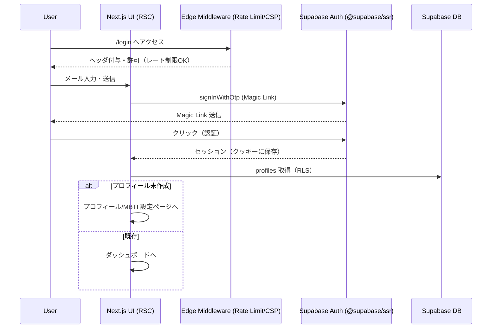
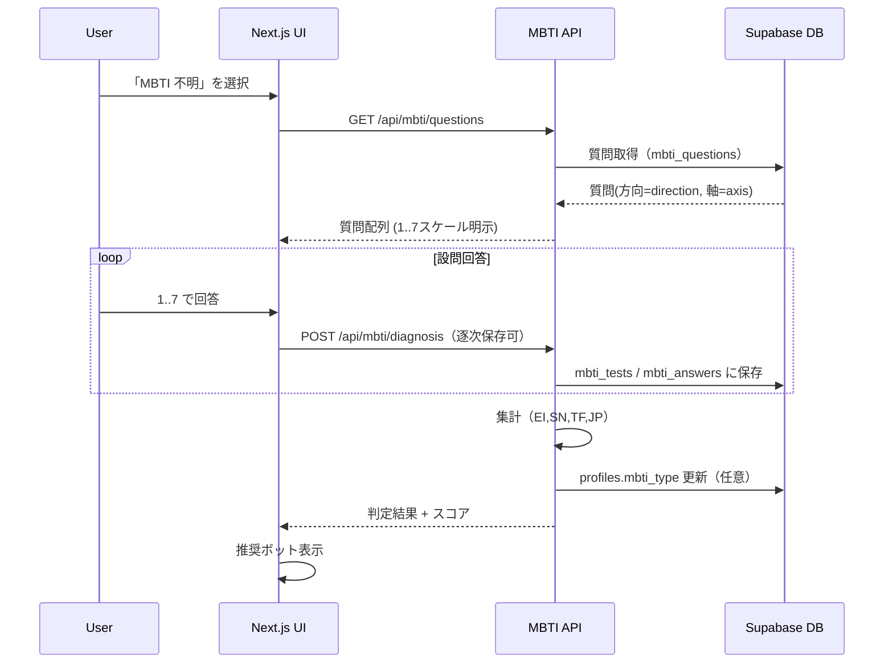
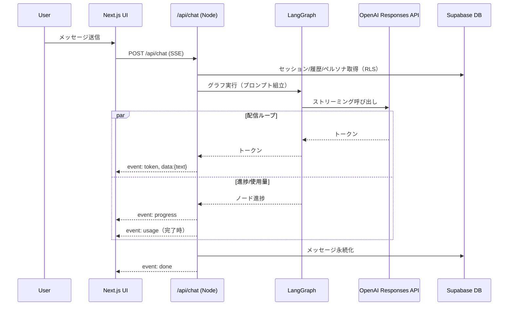
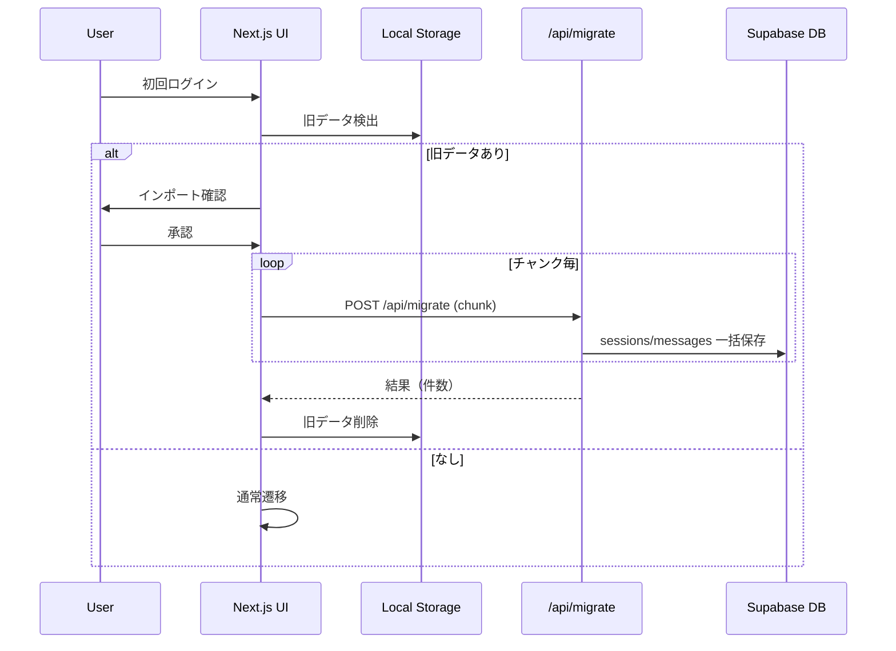

# MBTI チャットボットシステム 設計書

## 概要

本設計書は、MBTI（Myers-Briggs Type Indicator）を活用したパーソナライズドチャットボットの MVP を、**Next.js 15（App Router, React 19）**、**Supabase（Auth + PostgreSQL + RLS）**、**LangGraph**、**OpenAI（Responses API）**、および **Vercel AI SDK v5** を基盤に構築するための技術設計を定義する。

本改訂では、2025 年時点のベストプラクティスに準拠して以下を適用する：
- **SSR 認証**：`@supabase/ssr` によるクッキー連携・トークン自動リフレッシュ（非対称 JWT/JWKS に対応）。
- **SSE ストリーミング**：Route Handler（Node ランタイム）での **型付き SSE**（`event`/`id`/`retry` と 15 秒ハートビート）により安定配信と UI 即時性を最大化。
- **API の堅牢化**：**RFC 9457 Problem Details** に準拠したエラー応答と **Zod** による入出力スキーマ検証。
- **レート制限**：Edge Middleware での **`@upstash/ratelimit`** 実装。
- **観測性**：**OpenTelemetry（`instrumentation.js`）** によるストリーム・トレースと指標収集。
- **i18n**：`next-intl` による App Router ネイティブの多言語対応。

**変更禁止範囲**（据え置き）：既存の **ディレクトリ構造**、**Supabase の DB 設計（スキーマ）**、および **RLS ポリシー**。

## アーキテクチャ

### システム全体構成

```mermaid
graph TB
  subgraph "Client (Next.js 15, React 19)"
    UI[App Router (RSC)]
    I18N[next-intl]
    SSRAuth[@supabase/ssr (cookies)]
  end

  subgraph "Edge/Middleware"
    RL[Rate Limit (@upstash/ratelimit)]
    Sec[Security Headers (CSP/HSTS etc.)]
  end

  subgraph "API Layer (Route Handlers)"
    ChatAPI["/api/chat (Node runtime, SSE)"]
    AuthAPI["/api/auth"]
    PersonaAPI["/api/personas"]
    MBTIAPI["/api/mbti/*"]
    MigrationAPI["/api/migrate"]
  end

  subgraph "AI Layer"
    LangGraph[LangGraph Orchestrator]
    AISDK[Vercel AI SDK v5]
    OpenAI[OpenAI Responses API]
    PromptEngine[Dynamic Prompt Templates]
  end

  subgraph "Data Layer"
    SupabaseAuth[Supabase Auth (asymmetric JWT)]
    SupabaseDB[Supabase PostgreSQL]
    RLS[Row Level Security (unchanged)]
    Cache[Upstash Redis (rate limit/cache)]
  end

  UI --> RL
  RL --> UI
  UI --> ChatAPI
  UI --> AuthAPI
  UI --> PersonaAPI
  UI --> MBTIAPI
  UI --> MigrationAPI

  AuthAPI --> SupabaseAuth

  ChatAPI --> LangGraph
  LangGraph --> OpenAI
  ChatAPI --> AISDK
  PromptEngine --> SupabaseDB
  PersonaAPI --> SupabaseDB
  MBTIAPI --> SupabaseDB
  MigrationAPI --> SupabaseDB
  SupabaseDB --> RLS
  RL --> ChatAPI
  Cache --> RL
```

### データフロー設計（改訂）

#### 1. 認証（Magic Link + SSR）


#### 2. MBTI 診断
- **スケール統一**：回答は **1..7**（DB と整合）。UI の 5 段階は `1..7` に線形マップ可能（例：`1,2,3,4,5 → 1,2,3,5,7` など UI 側で補間）。


#### 3. チャット（SSE ストリーミング）
- **SSE 仕様**：`Content-Type: text/event-stream`、`event`（`token|progress|usage|error|done`）、`id` 連番、`retry`、**15s ハートビート**（`:\n\n`）を送出。


#### 4. ローカルデータ移行
- **分割インポート**（バッチ）と**冪等**を明示。大きなセッションはチャンク化。


## コンポーネントとインターフェース

### フロントエンドコンポーネント構造

```
src/
├── app/
│   ├── (auth)/
│   │   ├── login/
│   │   │   └── page.tsx              # ログイン画面
│   │   ├── signup/
│   │   │   └── page.tsx              # サインアップ画面
│   │   └── profile/
│   │       └── page.tsx              # プロフィール設定
│   ├── (dashboard)/
│   │   ├── chat/
│   │   │   └── page.tsx              # メインチャット画面
│   │   ├── personas/
│   │   │   └── page.tsx              # ボット管理画面
│   │   └── settings/
│   │       └── page.tsx              # 設定画面
│   ├── mbti/
│   │   ├── diagnosis/
│   │   │   └── page.tsx              # MBTI診断画面
│   │   └── result/
│   │       └── page.tsx              # 診断結果画面
│   └── api/
│       ├── auth/
│       │   └── route.ts              # 認証API
│       ├── chat/
│       │   └── route.ts              # チャットAPI（既存拡張）
│       ├── personas/
│       │   └── route.ts              # ボット管理API
│       ├── mbti/
│       │   ├── diagnosis/
│       │   │   └── route.ts          # 診断API
│       │   └── types/
│       │       └── route.ts          # MBTIタイプAPI
│       └── migrate/
│           └── route.ts              # データ移行API
├── components/
│   ├── auth/
│   │   ├── AuthProvider.tsx          # 認証プロバイダー
│   │   ├── LoginForm.tsx             # ログインフォーム
│   │   └── ProtectedRoute.tsx        # 認証ガード
│   ├── mbti/
│   │   ├── DiagnosisForm.tsx         # 診断フォーム
│   │   ├── TypeSelector.tsx          # タイプ選択
│   │   └── RecommendationCard.tsx    # 推奨ボット表示
│   ├── personas/
│   │   ├── PersonaEditor.tsx         # 性格パラメータエディタ
│   │   ├── PersonaList.tsx           # ボット一覧
│   │   └── ParameterSlider.tsx       # パラメータスライダー
│   ├── chat/
│   │   ├── Chat.tsx                  # メインチャット（既存拡張）
│   │   ├── SessionManager.tsx        # セッション管理
│   │   └── MessageBubble.tsx         # メッセージ表示
│   ├── migration/
│   │   ├── ImportModal.tsx           # データインポートモーダル
│   │   └── MigrationStatus.tsx       # 移行状況表示
│   └── i18n/
│       ├── LanguageProvider.tsx      # 多言語プロバイダー
│       └── LanguageToggle.tsx        # 言語切替
├── lib/
│   ├── supabase/
│   │   ├── client.ts                 # Supabaseクライアント
│   │   ├── auth.ts                   # 認証ヘルパー
│   │   └── database.types.ts         # DB型定義
│   ├── mbti/
│   │   ├── calculator.ts             # MBTI判定ロジック
│   │   ├── recommendations.ts        # 推奨アルゴリズム
│   │   └── questions.ts              # 診断設問データ
│   ├── personas/
│   │   ├── templates.ts              # プロンプトテンプレート
│   │   └── parameters.ts             # パラメータ定義
│   └── i18n/
│       ├── config.ts                 # 多言語設定
│       ├── translations/
│       │   ├── ja.json               # 日本語翻訳
│       │   └── en.json               # 英語翻訳
│       └── hooks.ts                  # 多言語フック
```

（補足）
- App Router/RSC 前提。**サーバコンポーネント優先**でデータ取得し、クライアント側は最小限に。
- 認証は **`@supabase/ssr`** を使い、`AuthProvider` では **クッキー連携の再検証**（自動更新）を考慮。
- SSE は `components/chat/Chat.tsx` で **EventSource** を使用し、**再接続（`retry`/`Last-Event-ID`）** と **ハートビート**に対応。
- i18n は `next-intl` を採用し、`components/i18n/**` は `app/[locale]/layout.tsx` でラップ。

### APIインターフェース設計（改訂）

> すべての API は **Zod** によるバリデーションを実施。  
> エラーは **RFC 9457 Problem Details**（`application/problem+json`）で返却。  
> GET Route Handlers は **Next.js 15 で既定非キャッシュ**（必要に応じ明示的に静的化）。

#### 1. 認証API (`/api/auth`) ※エントリーポイント最小化
- **Magic Link/OAuth 自体は Supabase Auth を利用**。本 API はクライアント統合の**補助（メッセージ/状態）**のみに留める。

```ts
// POST /api/auth/signup
interface SignupRequest {
  email: string;
  language?: 'ja' | 'en';
}
type Problem = {
  type: string; title: string; status: number; detail?: string; instance?: string;
};

type SignupResponse =
  | { success: true; message: string }   // 202 Accepted: Magic Link 送付
  | Problem;                             // RFC 9457
```

#### 2. MBTI診断API (`/api/mbti`)
- **スコアは DB と同一の 1..7**。方向（`direction` = -1|1）を設問に含め、集計で符号付与。

```ts
// GET /api/mbti/questions
interface Question {
  id: string;
  axis: 'EI' | 'SN' | 'TF' | 'JP';
  prompt: string;
  direction: 1 | -1;    // ← 用語を "direction" に統一
  scale: { min: 1; max: 7 };
}
interface QuestionsResponse { questions: Question[]; }

// POST /api/mbti/diagnosis
interface DiagnosisRequest {
  test_id?: string; // 省略時は新規作成し応答で返す
  answers: Array<{
    question_id: string;
    score: 1 | 2 | 3 | 4 | 5 | 6 | 7; // DB と整合
  }>;
  finalize?: boolean; // true なら集計・保存まで行い結果返却
}
interface DiagnosisResponse {
  test_id: string;
  mbti_type?: string; // finalize=true のとき
  scores?: { EI: number; SN: number; TF: number; JP: number };
}
```

#### 3. ボット管理API (`/api/personas`) ※インターフェースのみ再掲

```ts
// GET /api/personas
interface PersonaResponse {
  id: string;
  name: string;
  mbti: string | null;
  owner_id: string | null;
  params: PersonalityParameters;
  system_template: string;
  created_at: string;
}

// POST /api/personas
interface CreatePersonaRequest {
  name: string;
  mbti?: string;
  params: PersonalityParameters;
  system_template?: string;
}

// GET /api/personas/recommendations
interface RecommendationResponse {
  recommendations: Array<{
    persona: PersonaResponse;
    compatibility_score: number;
    reason: string;
  }>;
}
```

#### 4. 拡張チャットAPI (`/api/chat`) — **型付き SSE & 再接続対応**

```ts
// POST /api/chat (SSE)
interface ChatRequest {
  messages: Message[];
  personaId?: string;
  sessionId?: string;
  overrideParams?: Partial<PersonalityParameters>;
  // クライアント識別子（レート制限キー最適化）
  clientId?: string;
}

type SSEEvent =
  | { type: "token"; id: number; text: string }
  | { type: "progress"; node: string }
  | { type: "usage"; tokens_out: number; tokens_in?: number; model?: string }
  | { type: "error"; message: string; code?: string } // 可能なら RFC9457 と同等のサマリ
  | { type: "done" };
```

**SSE 送出要件**
- `Content-Type: text/event-stream`, `Cache-Control: no-cache, no-transform`, `Connection: keep-alive`
- **15 秒毎にハートビート**（`:\n\n`）を送信
- `retry: 5000` と **`id` 連番**を送出し、**Last-Event-ID 再開**に対応
- **例（サーバ送出）**：
```
retry: 5000
id: 1
event: token
data: {"type":"token","id":1,"text":"こん"}

id: 2
event: token
data: {"type":"token","id":2,"text":"にちは"}

: keepalive
```

#### 5. データ移行API (`/api/migrate`)
- **大規模データはチャンク分割**、サーバ側で**冪等**（重複キーは upsert/無視）を推奨。

```ts
// POST /api/migrate
interface MigrationRequest {
  sessions: Array<{
    id: string;
    title: string;
    messages: Array<{
      role: 'user' | 'assistant' | 'system';
      content: string;
      timestamp: string;
    }>;
    created_at: string;
  }>;
  chunk?: { index: number; total: number }; // 任意
}
interface MigrationResponse {
  success: boolean;
  imported_sessions: number;
  imported_messages: number;
  errors?: string[];
}

// GET /api/migrate/check
interface MigrationCheckResponse {
  has_legacy_data: boolean;
  session_count: number;
  message_count: number;
}
```

## データモデル

### Supabaseデータベーススキーマ

このプロジェクトでは、以下のPostgreSQL拡張・ENUM型・テーブル群・関数・RLSを採用します。提示のスキーマはSupabase標準の`auth.users`と連携し、厳格なRLSでセキュリティを担保します。

#### 0) 拡張
```sql
create extension if not exists pgcrypto;
create extension if not exists citext;
```

#### 1) ENUM 型
```sql
do $$
begin
  if not exists (select 1 from pg_type where typname = 'mbti_code') then
    create type mbti_code as enum (
      'INTJ','INTP','ENTJ','ENTP','INFJ','INFP','ENFJ','ENFP',
      'ISTJ','ISFJ','ESTJ','ESFJ','ISTP','ISFP','ESTP','ESFP'
    );
  end if;

  if not exists (select 1 from pg_type where typname = 'message_role') then
    create type message_role as enum ('user','assistant','system','tool');
  end if;

  if not exists (select 1 from pg_type where typname = 'session_status') then
    create type session_status as enum ('active','archived');
  end if;

  if not exists (select 1 from pg_type where typname = 'visibility') then
    create type visibility as enum ('private','public');
  end if;

  if not exists (select 1 from pg_type where typname = 'role_type') then
    create type role_type as enum ('user','admin');
  end if;

  if not exists (select 1 from pg_type where typname = 'mbti_axis') then
    create type mbti_axis as enum ('EI','SN','TF','JP');
  end if;
end $$;
```

#### 2) ユーティリティ関数
```sql
create or replace function set_updated_at()
returns trigger language plpgsql as $$
begin
  new.updated_at := now();
  return new;
end $$;
```

#### 3) プロフィール / 役割テーブル
```sql
create table if not exists profiles (
  id            uuid primary key references auth.users(id) on delete cascade,
  handle        citext unique,
  display_name  text,
  avatar_url    text,
  mbti_type     mbti_code,
  bio           text,
  preferences   jsonb not null default '{}',
  is_public     boolean not null default false,
  last_seen_at  timestamptz,
  created_at    timestamptz not null default now(),
  updated_at    timestamptz not null default now()
);
drop trigger if exists trg_profiles_updated_at on profiles;
create trigger trg_profiles_updated_at
before update on profiles
for each row execute function set_updated_at();

create table if not exists user_roles (
  user_id   uuid not null references auth.users(id) on delete cascade,
  role      role_type not null,
  created_at timestamptz not null default now(),
  primary key (user_id, role)
);
```

#### 4) 管理者判定関数（SECURITY DEFINER）
```sql
drop function if exists is_admin();
create or replace function is_admin()
returns boolean
security definer
set search_path = public
stable
language sql
as $$
  select exists (
    select 1 from user_roles
    where user_id = auth.uid() and role = 'admin'
  );
$$;
revoke all on function is_admin() from public;
grant execute on function is_admin() to authenticated;
-- 必要なら anon にも: grant execute on function is_admin() to anon;
```

#### 5) ボット・ペルソナ
```sql
create table if not exists bot_personas (
  id            uuid primary key default gen_random_uuid(),
  owner_id      uuid references auth.users(id) on delete set null, -- null=プリセット
  name          text not null,
  description   text,
  mbti_type     mbti_code,
  warmth        smallint not null default 50 check (warmth between 0 and 100),
  formality     smallint not null default 50 check (formality between 0 and 100),
  brevity       smallint not null default 50 check (brevity between 0 and 100),
  humor         smallint not null default 50 check (humor between 0 and 100),
  empathy       smallint not null default 50 check (empathy between 0 and 100),
  assertiveness smallint not null default 50 check (assertiveness between 0 and 100),
  creativity    smallint not null default 50 check (creativity between 0 and 100),
  rigor         smallint not null default 50 check (rigor between 0 and 100),
  emoji_usage   smallint not null default 25 check (emoji_usage between 0 and 100),
  steps         smallint not null default 1  check (steps between 1 and 20),
  visibility    visibility not null default 'private',
  system_prompt_template text,
  version       integer not null default 1,
  created_at    timestamptz not null default now(),
  updated_at    timestamptz not null default now()
);
create index if not exists idx_bot_personas_owner on bot_personas(owner_id);
create index if not exists idx_bot_personas_visibility on bot_personas(visibility);
drop trigger if exists trg_bot_personas_updated_at on bot_personas;
create trigger trg_bot_personas_updated_at
before update on bot_personas
for each row execute function set_updated_at();
```

#### 6) セッション / メッセージ / フィードバック
```sql
create table if not exists sessions (
  id             uuid primary key default gen_random_uuid(),
  user_id        uuid not null references auth.users(id) on delete cascade,
  persona_id     uuid references bot_personas(id) on delete set null,
  title          text,
  model          text,
  temperature    numeric(3,2) not null default 0.70 check (temperature between 0 and 2),
  status         session_status not null default 'active',
  message_count  integer not null default 0,
  last_message_at timestamptz,
  created_at     timestamptz not null default now(),
  updated_at     timestamptz not null default now(),
  deleted_at     timestamptz
);
create index if not exists idx_sessions_user_created on sessions(user_id, created_at desc);
create index if not exists idx_sessions_persona on sessions(persona_id);
drop trigger if exists trg_sessions_updated_at on sessions;
create trigger trg_sessions_updated_at
before update on sessions
for each row execute function set_updated_at();

create table if not exists messages (
  id                uuid primary key default gen_random_uuid(),
  session_id        uuid not null references sessions(id) on delete cascade,
  role              message_role not null,
  content           text not null,
  content_json      jsonb,
  model             text,
  tokens_prompt     integer,
  tokens_completion integer,
  error             text,
  created_at        timestamptz not null default now()
);
create index if not exists idx_messages_session_created on messages(session_id, created_at);
create index if not exists idx_messages_session_id on messages(session_id, id);

create or replace function bump_session_on_message()
returns trigger language plpgsql as $$
begin
  update sessions
     set message_count = message_count + 1,
         last_message_at = now(),
         updated_at = now()
   where id = new.session_id;
  return new;
end $$;
drop trigger if exists trg_messages_after_insert on messages;
create trigger trg_messages_after_insert
after insert on messages
for each row execute function bump_session_on_message();

create table if not exists message_feedback (
  id         uuid primary key default gen_random_uuid(),
  message_id uuid not null references messages(id) on delete cascade,
  user_id    uuid not null references auth.users(id) on delete cascade,
  rating     smallint not null check (rating in (-1, 1)),
  reason     text,
  created_at timestamptz not null default now(),
  unique (message_id, user_id)
);
```

#### 7) MBTI（質問・受検・回答・相性）
```sql
create table if not exists mbti_questions (
  id         uuid primary key default gen_random_uuid(),
  code       text unique,
  text       text not null,
  axis       mbti_axis not null,
  direction  smallint not null default 1 check (direction in (-1, 1)),
  "order"    integer not null,
  locale     text not null default 'ja',
  is_active  boolean not null default true,
  created_at timestamptz not null default now(),
  updated_at timestamptz not null default now()
);
drop trigger if exists trg_mbti_questions_updated_at on mbti_questions;
create trigger trg_mbti_questions_updated_at
before update on mbti_questions
for each row execute function set_updated_at();

create table if not exists mbti_tests (
  id              uuid primary key default gen_random_uuid(),
  user_id         uuid not null references auth.users(id) on delete cascade,
  started_at      timestamptz not null default now(),
  completed_at    timestamptz,
  status          text not null default 'in_progress',
  determined_type mbti_code,
  scores          jsonb,
  created_at      timestamptz not null default now(),
  updated_at      timestamptz not null default now()
);
create index if not exists idx_mbti_tests_user_created on mbti_tests(user_id, created_at desc);
drop trigger if exists trg_mbti_tests_updated_at on mbti_tests;
create trigger trg_mbti_tests_updated_at
before update on mbti_tests
for each row execute function set_updated_at();

create table if not exists mbti_answers (
  id           uuid primary key default gen_random_uuid(),
  test_id      uuid not null references mbti_tests(id) on delete cascade,
  question_id  uuid not null references mbti_questions(id) on delete restrict,
  score        smallint not null check (score between 1 and 7),
  created_at   timestamptz not null default now(),
  unique (test_id, question_id)
);
create index if not exists idx_mbti_answers_test on mbti_answers(test_id);

create table if not exists mbti_compatibilities (
  type_a mbti_code not null,
  type_b mbti_code not null,
  score  smallint not null check (score between 0 and 100),
  primary key (type_a, type_b)
);
```

#### 8) SSE/ストリーミング監査ログ
```sql
create table if not exists sse_events (
  id          uuid primary key default gen_random_uuid(),
  user_id     uuid not null references auth.users(id) on delete cascade,
  session_id  uuid references sessions(id) on delete set null,
  event_type  text not null check (event_type in ('start','end','interrupt','error')),
  detail      text,
  request_id  text,
  created_at  timestamptz not null default now()
);
create index if not exists idx_sse_events_user_created on sse_events(user_id, created_at desc);
```

#### 9) RPC（クライアント用安全投稿）
```sql
create or replace function post_user_message(p_session_id uuid, p_content text)
returns uuid
language plpgsql
as $$
declare
  new_id uuid;
begin
  insert into messages (id, session_id, role, content)
  values (gen_random_uuid(), p_session_id, 'user', p_content)
  returning id into new_id;
  return new_id;
end $$;
grant execute on function post_user_message(uuid, text) to authenticated;
```

### Row Level Security (RLS) ポリシー

#### 10) RLS 有効化
```sql
alter table profiles enable row level security;
alter table user_roles enable row level security;
alter table bot_personas enable row level security;
alter table sessions enable row level security;
alter table messages enable row level security;
alter table message_feedback enable row level security;
alter table mbti_questions enable row level security;
alter table mbti_tests enable row level security;
alter table mbti_answers enable row level security;
alter table mbti_compatibilities enable row level security;
alter table sse_events enable row level security;
```

#### 11) RLS ポリシー
```sql
-- profiles
drop policy if exists "profiles_select_owner_or_public" on profiles;
create policy "profiles_select_owner_or_public"
on profiles
for select
to authenticated
using ( id = auth.uid() or is_public );

drop policy if exists "profiles_update_owner" on profiles;
create policy "profiles_update_owner"
on profiles
for update
to authenticated
using ( id = auth.uid() )
with check ( id = auth.uid() );

drop policy if exists "profiles_insert_self" on profiles;
create policy "profiles_insert_self"
on profiles
for insert
to authenticated
with check ( id = auth.uid() );

drop policy if exists "profiles_admin_select_all" on profiles;
create policy "profiles_admin_select_all"
on profiles
for select
to authenticated
using ( is_admin() );

-- user_roles（通常は不可視、管理者のみ読取）
drop policy if exists "user_roles_admin_read" on user_roles;
create policy "user_roles_admin_read"
on user_roles
for select
to authenticated
using ( is_admin() );

-- bot_personas
drop policy if exists "bot_personas_select_public_or_owner" on bot_personas;
create policy "bot_personas_select_public_or_owner"
on bot_personas
for select
to authenticated
using ( visibility = 'public' or owner_id = auth.uid() );

drop policy if exists "bot_personas_insert_owner" on bot_personas;
create policy "bot_personas_insert_owner"
on bot_personas
for insert
to authenticated
with check ( owner_id = auth.uid() );

drop policy if exists "bot_personas_update_owner" on bot_personas;
create policy "bot_personas_update_owner"
on bot_personas
for update
to authenticated
using ( owner_id = auth.uid() )
with check ( owner_id = auth.uid() );

drop policy if exists "bot_personas_delete_owner" on bot_personas;
create policy "bot_personas_delete_owner"
on bot_personas
for delete
to authenticated
using ( owner_id = auth.uid() );

drop policy if exists "bot_personas_admin_all" on bot_personas;
create policy "bot_personas_admin_all"
on bot_personas
for all
to authenticated
using ( is_admin() )
with check ( is_admin() );

-- sessions
drop policy if exists "sessions_select_owner" on sessions;
create policy "sessions_select_owner"
on sessions
for select
to authenticated
using ( user_id = auth.uid() );

drop policy if exists "sessions_insert_owner" on sessions;
create policy "sessions_insert_owner"
on sessions
for insert
to authenticated
with check ( user_id = auth.uid() );

drop policy if exists "sessions_update_owner" on sessions;
create policy "sessions_update_owner"
on sessions
for update
to authenticated
using ( user_id = auth.uid() )
with check ( user_id = auth.uid() );

drop policy if exists "sessions_delete_owner" on sessions;
create policy "sessions_delete_owner"
on sessions
for delete
to authenticated
using ( user_id = auth.uid() );

-- messages
drop policy if exists "messages_select_session_owner" on messages;
create policy "messages_select_session_owner"
on messages
for select
to authenticated
using (
  exists (
    select 1 from sessions s
    where s.id = session_id and s.user_id = auth.uid()
  )
);

drop policy if exists "messages_insert_user_role_only" on messages;
create policy "messages_insert_user_role_only"
on messages
for insert
to authenticated
with check (
  role = 'user' and
  exists (
    select 1 from sessions s
    where s.id = session_id and s.user_id = auth.uid()
  )
);
-- assistant/system の書込は server 側（service_role）専用

-- message_feedback
drop policy if exists "message_feedback_rw_owner" on message_feedback;
create policy "message_feedback_rw_owner"
on message_feedback
for select
to authenticated
using ( user_id = auth.uid() );

drop policy if exists "message_feedback_insert_owner" on message_feedback;
create policy "message_feedback_insert_owner"
on message_feedback
for insert
to authenticated
with check ( user_id = auth.uid() );

-- mbti_questions / mbti_compatibilities
drop policy if exists "mbti_questions_select_all" on mbti_questions;
create policy "mbti_questions_select_all"
on mbti_questions
for select
to authenticated
using ( true );

drop policy if exists "mbti_questions_admin_write" on mbti_questions;
create policy "mbti_questions_admin_write"
on mbti_questions
for all
to authenticated
using ( is_admin() )
with check ( is_admin() );

drop policy if exists "mbti_compat_select_all" on mbti_compatibilities;
create policy "mbti_compat_select_all"
on mbti_compatibilities
for select
to authenticated
using ( true );

drop policy if exists "mbti_compat_admin_write" on mbti_compatibilities;
create policy "mbti_compat_admin_write"
on mbti_compatibilities
for all
to authenticated
using ( is_admin() )
with check ( is_admin() );

-- mbti_tests / mbti_answers
drop policy if exists "mbti_tests_rw_owner" on mbti_tests;
create policy "mbti_tests_rw_owner"
on mbti_tests
for select
to authenticated
using ( user_id = auth.uid() );

drop policy if exists "mbti_tests_insert_owner" on mbti_tests;
create policy "mbti_tests_insert_owner"
on mbti_tests
for insert
to authenticated
with check ( user_id = auth.uid() );

drop policy if exists "mbti_tests_update_owner" on mbti_tests;
create policy "mbti_tests_update_owner"
on mbti_tests
for update
to authenticated
using ( user_id = auth.uid() )
with check ( user_id = auth.uid() );

drop policy if exists "mbti_answers_rw_owner" on mbti_answers;
create policy "mbti_answers_rw_owner"
on mbti_answers
for select
to authenticated
using (
  exists (
    select 1 from mbti_tests t
    where t.id = test_id and t.user_id = auth.uid()
  )
);

drop policy if exists "mbti_answers_insert_owner" on mbti_answers;
create policy "mbti_answers_insert_owner"
on mbti_answers
for insert
to authenticated
with check (
  exists (
    select 1 from mbti_tests t
    where t.id = test_id and t.user_id = auth.uid()
  )
);

-- sse_events
drop policy if exists "sse_events_select_owner" on sse_events;
create policy "sse_events_select_owner"
on sse_events
for select
to authenticated
using ( user_id = auth.uid() );

drop policy if exists "sse_events_insert_owner" on sse_events;
create policy "sse_events_insert_owner"
on sse_events
for insert
to authenticated
with check ( user_id = auth.uid() );

drop policy if exists "sse_events_admin_read_all" on sse_events;
create policy "sse_events_admin_read_all"
on sse_events
for select
to authenticated
using ( is_admin() );
```

## セキュリティ設計（新規）

- **認証**
  - **@supabase/ssr** を採用し、**サーバ/クライアントで統一**された Supabase クライアントを利用。セッションは **HttpOnly/Secure/SameSite** のクッキーで管理。
  - Supabase の **非対称 JWT**（JWKS）移行に対応。Edge/Route Handler での検証は **`getUser`（サーバクライアント）**を通し RLS に委譲（自前の署名検証は不要/最小化）。
- **ヘッダ**
  - `Content-Security-Policy`（script-src 'self' 'strict-dynamic'; object-src 'none'; base-uri 'self'; frame-ancestors 'none' ...）
  - `Strict-Transport-Security`, `X-Frame-Options`（=DENY）, `Cross-Origin-Opener-Policy`, `Cross-Origin-Embedder-Policy`, `Referrer-Policy` 等
- **レート制限**
  - **Edge Middleware + @upstash/ratelimit** で IP/ユーザ単位にしきい値（短周期/長周期の二段階）。429 返却は Problem Details で。
- **権限境界**
  - **service_role** キーは **サーバ専用**（Route Handler/Edge Functions のみ）。クライアントへ露出禁止。
  - `SECURITY DEFINER` RPC は用途限定・監査ログ（`sse_events` に request_id を結合）。
- **依存の隔離**
  - Chat API は Node ランタイム（LangGraph 依存）、Edge は Middleware のみ（軽量・高頻度）。

## エラーハンドリング（改訂）

- **入力検証**：すべての Route Handler で **Zod** による `safeParse`。失敗時は **400** と **Problem Details (RFC 9457)** を返却。
- **統一形式**：`application/problem+json`、`{ type, title, status, detail, instance }`。再試行可能性などは `type` の URI で意味付け。
- **SSE**：致命的エラーは `event: error` を送出しつつ、**HTTP レスポンスも 200** で完走（SSE プロトコル上の慣例）。クライアントは `type === 'error'` を UI へ反映し、再接続の可否を判断。
- **再試行**：SSE で `retry`（ms）を明示。クライアントは **`Last-Event-ID`** を送出し再開。
- **ログ/監査**：`sse_events` に `event_type`、`detail`、`request_id` を保存。Problem も合わせて記録。

## テスト戦略（改訂）

- **ユニット**：ビジネスロジックは `src/lib/**` を最優先で単体検証。Zod スキーマは **スナップショット**で後方互換性チェック。
- **統合**：Route Handler は **node 環境**でフェッチベースに検証。SSE は `eventsource-parser`（あるいはモック）でストリーム確認。
- **E2E**：Playwright で **EventSource** の受信を検証（トークン分割、ハートビート受信、`done` 受信、切断後の再接続）。
- **観測性テスト**：OpenTelemetry のエクスポート有無（本番は OTLP、テストは in-memory）を切替。ストリーム span に `first_token_latency_ms` `tps` を付与ししきい値検証。

## システム性能要件（改訂）

### 目標
- 初回トークン < **700ms**
- トークンレート > **25 tok/s**

### 実装指針
- **Route Handler（Node runtime）**：
  - **バックプレッシャ対応**の `TransformStream`（`TextEncoderStream` で JSON→UTF-8）を使用。
  - **Nagle 無効化/圧縮回避**（`no-transform`）とヘッダ：`Content-Type: text/event-stream`, `Cache-Control: no-cache, no-transform`, `Connection: keep-alive`。
  - **ハートビート**：15s 毎に `:\n\n` を送出（中間プロキシのアイドル切断回避）。
  - **`retry` と `id`** を送出し、**`Last-Event-ID` 再開**に対応。
- **LangGraph / OpenAI**：
  - モデルからのチャンクを逐次フラッシュし、**まとめ過ぎによる遅延**を避ける。
  - 終了時に `usage` を集計し **最後に 1 回** 送出。
- **観測**：`instrumentation.js`（OpenTelemetry）で **first_token_latency_ms** と **tokens_per_second** を span 属性に記録、SLO 違反を可視化。

### 可用性設計

**設計判断**: 要件10.5で定義された99.5%可用性を達成するため、以下の冗長化戦略を採用：

- **Vercel Edge Functions**: 地理的分散によるレイテンシ削減
- **Supabase Multi-Region**: データベース冗長化
- **Circuit Breaker Pattern**: 外部API障害時のフォールバック
- **Graceful Degradation**: 機能段階的縮退

## 多言語対応設計（改訂）

- **ライブラリ**：`next-intl` を採用し App Router と親和（RSC/静的化/プレフィクス/非プレフィクス両対応）。
- **基本構成**：
  - ルーティング：`app/[locale]/layout.tsx` でロケールごとにメッセージを供給。
  - サーバで翻訳し、クライアントへは文字列を props で伝搬（必要時のみクライアント化）。
- **例**：
```ts
// app/[locale]/layout.tsx
import { NextIntlClientProvider } from 'next-intl';
import { getMessages, getLocale } from '@/lib/i18n/server';

export default async function RootLayout({ children }: { children: React.ReactNode }) {
  const locale = await getLocale();
  const messages = await getMessages(locale);
  return <NextIntlClientProvider locale={locale} messages={messages}>{children}</NextIntlClientProvider>;
}
```
- **メタデータ/ルート**：`generateMetadata` でもロケールを考慮。`next-intl` の推奨に従う。

## 参考実装スニペット

**SSE Route Handler の骨子（Node runtime）**
```ts
// app/api/chat/route.ts
import { NextRequest } from 'next/server';

export const runtime = 'nodejs';         // LangGraph 互換性のため Node を指定
export const dynamic = 'force-dynamic';  // 応答キャッシュ無効（Next.js 15 の既定に合致）

export async function POST(req: NextRequest) {
  const { readable, writable } = new TransformStream();
  const writer = writable.getWriter();
  const enc = new TextEncoder();

  const send = (e: any, id?: number) => {
    const head = id ? `id: ${id}\n` : '';
    const body = `event: ${e.type}\n` + `data: ${JSON.stringify(e)}\n\n`;
    return writer.write(enc.encode(head + body));
  };

  // 15s ハートビート
  const heartbeat = setInterval(() => writer.write(enc.encode(':\n\n')), 15000);
  await writer.write(enc.encode('retry: 5000\n\n'));

  try {
    // LangGraph 実行 → OpenAI ストリーム購読
    let i = 0;
    for await (const chunk of runLangGraphStream(/* ... */)) {
      await send({ type: 'token', text: chunk }, ++i);
    }
    await send({ type: 'usage', tokens_out: 123, model: 'gpt-5' });
    await send({ type: 'done' });
  } catch (err: any) {
    await send({ type: 'error', message: err?.message ?? 'stream_error' });
  } finally {
    clearInterval(heartbeat);
    await writer.close();
  }

  return new Response(readable, {
    headers: {
      'Content-Type': 'text/event-stream',
      'Cache-Control': 'no-cache, no-transform',
      'Connection': 'keep-alive',
    },
  });
}
```