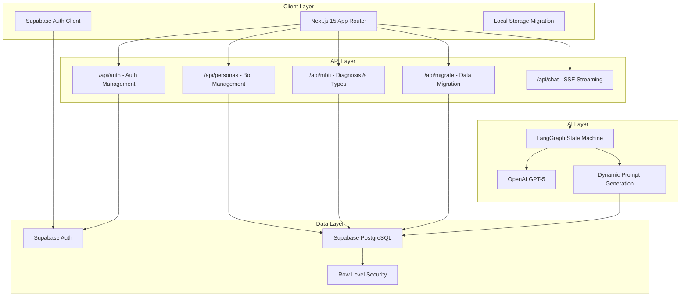
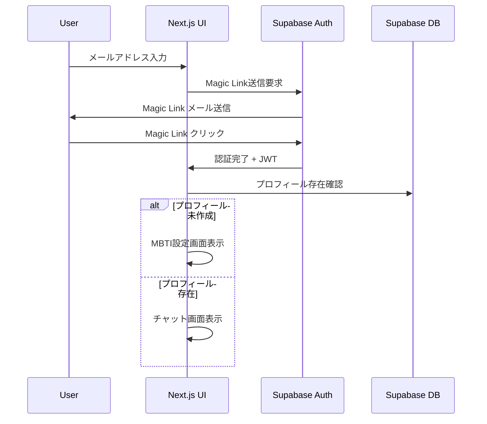
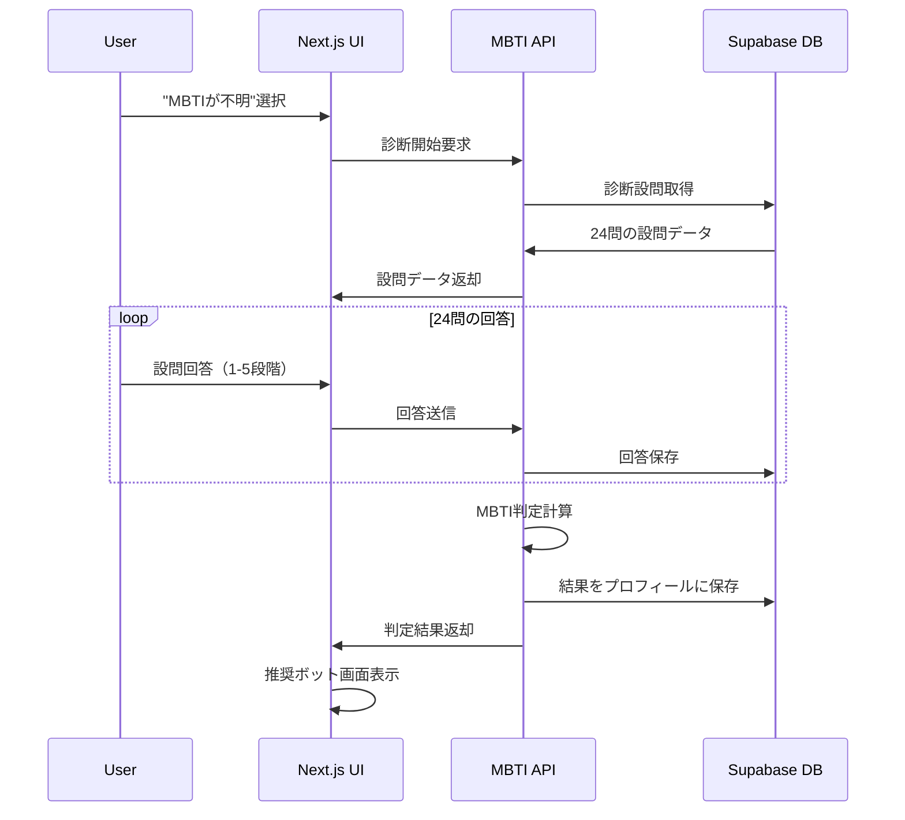
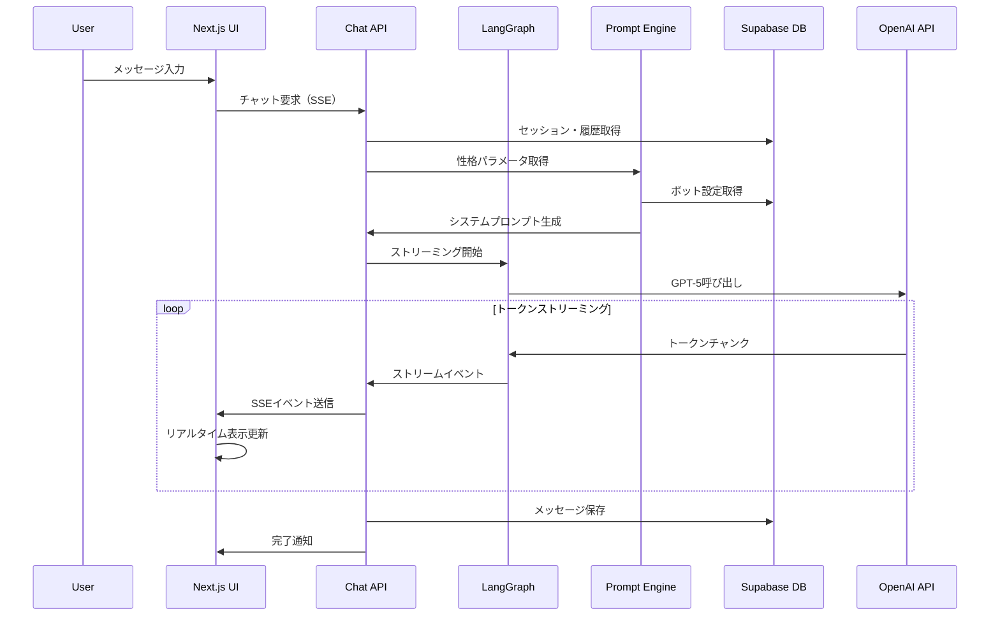
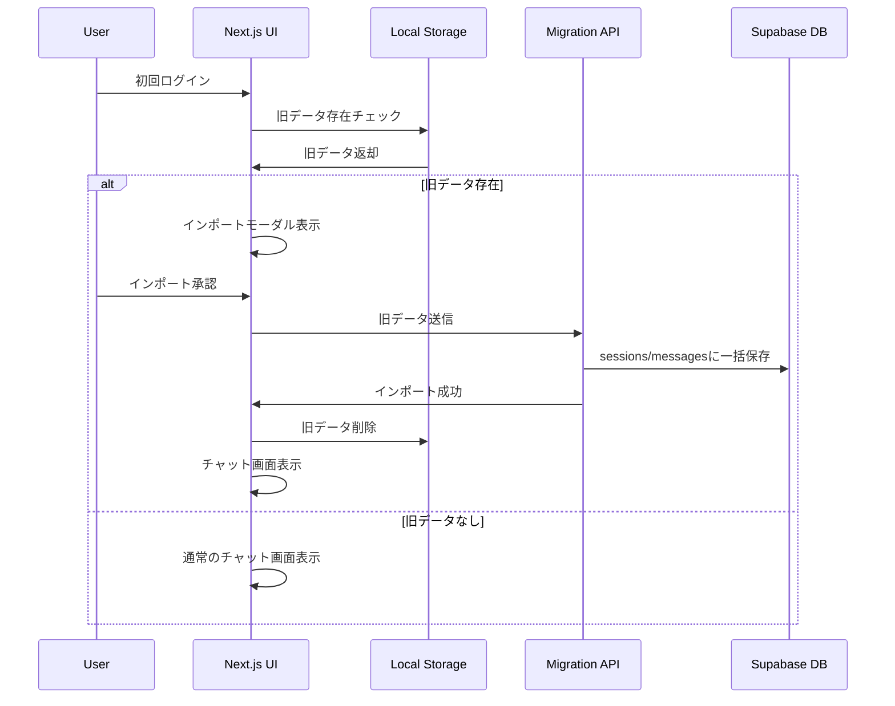

# MBTI チャットボットシステム 設計書

## 概要

本設計書は、MBTI（Myers-Briggs Type Indicator）を活用したパーソナライズドチャットボットシステムのMVPの技術設計を定義します。現在のNext.js + LangGraphベースのチャットシステムを拡張し、Supabaseによるユーザー認証・データ永続化、MBTI診断機能、性格パラメータベースのボットカスタマイズ機能、ローカルデータ移行機能を追加します。GPT-5とLangGraphによるリアルタイムストリーミングで自然な対話体験を実現します。

## アーキテクチャ

### システム全体構成



### データフロー設計

#### 1. ユーザー認証フロー


#### 2. MBTI診断フロー


#### 3. チャットストリーミングフロー


#### 4. ローカルデータ移行フロー


## コンポーネントとインターフェース

### フロントエンドコンポーネント構造

```
src/
├── app/
│   ├── (auth)/
│   │   ├── login/
│   │   │   └── page.tsx              # ログイン画面
│   │   ├── signup/
│   │   │   └── page.tsx              # サインアップ画面
│   │   └── profile/
│   │       └── page.tsx              # プロフィール設定
│   ├── (dashboard)/
│   │   ├── chat/
│   │   │   └── page.tsx              # メインチャット画面
│   │   ├── personas/
│   │   │   └── page.tsx              # ボット管理画面
│   │   └── settings/
│   │       └── page.tsx              # 設定画面
│   ├── mbti/
│   │   ├── diagnosis/
│   │   │   └── page.tsx              # MBTI診断画面
│   │   └── result/
│   │       └── page.tsx              # 診断結果画面
│   └── api/
│       ├── auth/
│       │   └── route.ts              # 認証API
│       ├── chat/
│       │   └── route.ts              # チャットAPI（既存拡張）
│       ├── personas/
│       │   └── route.ts              # ボット管理API
│       ├── mbti/
│       │   ├── diagnosis/
│       │   │   └── route.ts          # 診断API
│       │   └── types/
│       │       └── route.ts          # MBTIタイプAPI
│       └── migrate/
│           └── route.ts              # データ移行API
├── components/
│   ├── auth/
│   │   ├── AuthProvider.tsx          # 認証プロバイダー
│   │   ├── LoginForm.tsx             # ログインフォーム
│   │   └── ProtectedRoute.tsx        # 認証ガード
│   ├── mbti/
│   │   ├── DiagnosisForm.tsx         # 診断フォーム
│   │   ├── TypeSelector.tsx          # タイプ選択
│   │   └── RecommendationCard.tsx    # 推奨ボット表示
│   ├── personas/
│   │   ├── PersonaEditor.tsx         # 性格パラメータエディタ
│   │   ├── PersonaList.tsx           # ボット一覧
│   │   └── ParameterSlider.tsx       # パラメータスライダー
│   ├── chat/
│   │   ├── Chat.tsx                  # メインチャット（既存拡張）
│   │   ├── SessionManager.tsx        # セッション管理
│   │   └── MessageBubble.tsx         # メッセージ表示
│   ├── migration/
│   │   ├── ImportModal.tsx           # データインポートモーダル
│   │   └── MigrationStatus.tsx       # 移行状況表示
│   └── i18n/
│       ├── LanguageProvider.tsx      # 多言語プロバイダー
│       └── LanguageToggle.tsx        # 言語切替
├── lib/
│   ├── supabase/
│   │   ├── client.ts                 # Supabaseクライアント
│   │   ├── auth.ts                   # 認証ヘルパー
│   │   └── database.types.ts         # DB型定義
│   ├── mbti/
│   │   ├── calculator.ts             # MBTI判定ロジック
│   │   ├── recommendations.ts        # 推奨アルゴリズム
│   │   └── questions.ts              # 診断設問データ
│   ├── personas/
│   │   ├── templates.ts              # プロンプトテンプレート
│   │   └── parameters.ts             # パラメータ定義
│   └── i18n/
│       ├── config.ts                 # 多言語設定
│       ├── translations/
│       │   ├── ja.json               # 日本語翻訳
│       │   └── en.json               # 英語翻訳
│       └── hooks.ts                  # 多言語フック
```

### APIインターフェース設計

#### 1. 認証API (`/api/auth`)
```typescript
// POST /api/auth/signup
interface SignupRequest {
  email: string;
  language?: 'ja' | 'en';
}

interface SignupResponse {
  success: boolean;
  message: string;
}

// POST /api/auth/profile
interface ProfileRequest {
  mbti?: string;
  language?: 'ja' | 'en';
}

interface ProfileResponse {
  id: string;
  email: string;
  mbti: string | null;
  language: 'ja' | 'en';
  created_at: string;
  updated_at: string;
}
```

#### 2. MBTI診断API (`/api/mbti`)
```typescript
// GET /api/mbti/questions
interface Question {
  id: string;
  axis: 'EI' | 'SN' | 'TF' | 'JP';
  prompt: string;
  polarity: 1 | -1;
}

interface QuestionsResponse {
  questions: Question[];
}

// POST /api/mbti/diagnosis
interface DiagnosisRequest {
  answers: Array<{
    question_id: string;
    score: -2 | -1 | 0 | 1 | 2;
  }>;
}

interface DiagnosisResponse {
  mbti_type: string;
  scores: {
    EI: number;
    SN: number;
    TF: number;
    JP: number;
  };
}
```

#### 3. ボット管理API (`/api/personas`)
```typescript
// GET /api/personas
interface PersonaResponse {
  id: string;
  name: string;
  mbti: string | null;
  owner_id: string | null;
  params: PersonalityParameters;
  system_template: string;
  created_at: string;
}

// POST /api/personas
interface CreatePersonaRequest {
  name: string;
  mbti?: string;
  params: PersonalityParameters;
  system_template?: string;
}

// GET /api/personas/recommendations
interface RecommendationResponse {
  recommendations: Array<{
    persona: PersonaResponse;
    compatibility_score: number;
    reason: string;
  }>;
}
```

#### 4. 拡張チャットAPI (`/api/chat`)
```typescript
// 既存のチャットAPIを拡張
interface ChatRequest {
  messages: Message[];
  systemPrompt?: string;
  personaId?: string;           // 新規追加
  sessionId?: string;           // 新規追加
  overrideParams?: Partial<PersonalityParameters>; // 新規追加
}

// SSEイベント型も拡張
type SSEEvent = 
  | { type: "token", text: string }
  | { type: "error", message: string }
  | { type: "done" }
  | { type: "progress", node: string }     // 新規追加
  | { type: "usage", tokens_out: number }  // 新規追加
```

#### 5. データ移行API (`/api/migrate`)
```typescript
// POST /api/migrate
interface MigrationRequest {
  sessions: Array<{
    id: string;
    title: string;
    messages: Array<{
      role: 'user' | 'assistant' | 'system';
      content: string;
      timestamp: string;
    }>;
    created_at: string;
  }>;
}

interface MigrationResponse {
  success: boolean;
  imported_sessions: number;
  imported_messages: number;
  errors?: string[];
}

// GET /api/migrate/check
interface MigrationCheckResponse {
  has_legacy_data: boolean;
  session_count: number;
  message_count: number;
}
```

## データモデル

### Supabaseデータベーススキーマ

#### 1. プロフィールテーブル
```sql
-- profiles テーブル（auth.usersの拡張）
CREATE TABLE public.profiles (
  id UUID REFERENCES auth.users(id) PRIMARY KEY,
  email TEXT,
  mbti TEXT CHECK (mbti IN (
    'INTJ', 'INTP', 'ENTJ', 'ENTP',
    'INFJ', 'INFP', 'ENFJ', 'ENFP',
    'ISTJ', 'ISFJ', 'ESTJ', 'ESFJ',
    'ISTP', 'ISFP', 'ESTP', 'ESFP'
  )),
  language TEXT DEFAULT 'ja' CHECK (language IN ('ja', 'en')),
  created_at TIMESTAMP WITH TIME ZONE DEFAULT NOW(),
  updated_at TIMESTAMP WITH TIME ZONE DEFAULT NOW()
);
```

#### 2. セッション・メッセージテーブル
```sql
-- sessions テーブル
CREATE TABLE public.sessions (
  id UUID DEFAULT gen_random_uuid() PRIMARY KEY,
  user_id UUID REFERENCES public.profiles(id) ON DELETE CASCADE,
  title TEXT NOT NULL,
  persona_id UUID REFERENCES public.bot_personas(id),
  created_at TIMESTAMP WITH TIME ZONE DEFAULT NOW(),
  updated_at TIMESTAMP WITH TIME ZONE DEFAULT NOW()
);

-- messages テーブル
CREATE TABLE public.messages (
  id UUID DEFAULT gen_random_uuid() PRIMARY KEY,
  session_id UUID REFERENCES public.sessions(id) ON DELETE CASCADE,
  role TEXT CHECK (role IN ('user', 'assistant', 'system')),
  content TEXT NOT NULL,
  model TEXT,
  tokens_in INTEGER,
  tokens_out INTEGER,
  created_at TIMESTAMP WITH TIME ZONE DEFAULT NOW()
);
```

#### 3. ボット・性格パラメータテーブル
```sql
-- bot_personas テーブル
CREATE TABLE public.bot_personas (
  id UUID DEFAULT gen_random_uuid() PRIMARY KEY,
  owner_id UUID REFERENCES public.profiles(id), -- NULLの場合はプリセット
  name TEXT NOT NULL,
  mbti TEXT,
  params JSONB NOT NULL DEFAULT '{}',
  system_template TEXT NOT NULL,
  created_at TIMESTAMP WITH TIME ZONE DEFAULT NOW()
);

-- 性格パラメータのJSONBスキーマ例
-- {
--   "warmth": 0.7,
--   "formality": 0.2,
--   "concision": 0.5,
--   "humor": 0.6,
--   "empathy": 0.8,
--   "proactivity": 0.4,
--   "creativity": 0.7,
--   "analytical": 0.6,
--   "emoji_usage": "sparingly",
--   "structure": "bullet"
-- }
```

#### 4. MBTI診断テーブル
```sql
-- mbti_questions テーブル
CREATE TABLE public.mbti_questions (
  id UUID DEFAULT gen_random_uuid() PRIMARY KEY,
  axis TEXT CHECK (axis IN ('EI', 'SN', 'TF', 'JP')),
  prompt_ja TEXT NOT NULL,
  prompt_en TEXT NOT NULL,
  polarity INTEGER CHECK (polarity IN (-1, 1)),
  order_index INTEGER NOT NULL
);

-- mbti_answers テーブル
CREATE TABLE public.mbti_answers (
  id UUID DEFAULT gen_random_uuid() PRIMARY KEY,
  user_id UUID REFERENCES public.profiles(id) ON DELETE CASCADE,
  question_id UUID REFERENCES public.mbti_questions(id),
  score INTEGER CHECK (score BETWEEN -2 AND 2),
  created_at TIMESTAMP WITH TIME ZONE DEFAULT NOW()
);
```

### Row Level Security (RLS) ポリシー

```sql
-- プロフィール
ALTER TABLE public.profiles ENABLE ROW LEVEL SECURITY;

CREATE POLICY "Users can view own profile" ON public.profiles
  FOR SELECT USING (auth.uid() = id);

CREATE POLICY "Users can insert own profile" ON public.profiles
  FOR INSERT WITH CHECK (auth.uid() = id);

CREATE POLICY "Users can update own profile" ON public.profiles
  FOR UPDATE USING (auth.uid() = id);

-- セッション
ALTER TABLE public.sessions ENABLE ROW LEVEL SECURITY;

CREATE POLICY "Users can manage own sessions" ON public.sessions
  FOR ALL USING (auth.uid() = user_id) WITH CHECK (auth.uid() = user_id);

-- メッセージ
ALTER TABLE public.messages ENABLE ROW LEVEL SECURITY;

CREATE POLICY "Users can manage own messages" ON public.messages
  FOR ALL USING (
    auth.uid() IN (
      SELECT user_id FROM public.sessions WHERE id = messages.session_id
    )
  ) WITH CHECK (
    auth.uid() IN (
      SELECT user_id FROM public.sessions WHERE id = messages.session_id
    )
  );

-- ボットペルソナ
ALTER TABLE public.bot_personas ENABLE ROW LEVEL SECURITY;

CREATE POLICY "Users can view all personas" ON public.bot_personas
  FOR SELECT USING (true); -- プリセット含む全て閲覧可能

CREATE POLICY "Users can manage own personas" ON public.bot_personas
  FOR INSERT WITH CHECK (auth.uid() = owner_id);

CREATE POLICY "Users can update own personas" ON public.bot_personas
  FOR UPDATE USING (auth.uid() = owner_id);

CREATE POLICY "Users can delete own personas" ON public.bot_personas
  FOR DELETE USING (auth.uid() = owner_id);

-- MBTI回答
ALTER TABLE public.mbti_answers ENABLE ROW LEVEL SECURITY;

CREATE POLICY "Users can manage own answers" ON public.mbti_answers
  FOR ALL USING (auth.uid() = user_id) WITH CHECK (auth.uid() = user_id);
```

## エラーハンドリング

### エラー分類と対応戦略

#### 1. 認証エラー
```typescript
enum AuthError {
  INVALID_EMAIL = 'INVALID_EMAIL',
  MAGIC_LINK_EXPIRED = 'MAGIC_LINK_EXPIRED',
  UNAUTHORIZED = 'UNAUTHORIZED',
  PROFILE_NOT_FOUND = 'PROFILE_NOT_FOUND'
}

// エラーハンドリング例
const handleAuthError = (error: AuthError, language: 'ja' | 'en') => {
  const messages = {
    ja: {
      [AuthError.INVALID_EMAIL]: 'メールアドレスが無効です',
      [AuthError.MAGIC_LINK_EXPIRED]: 'マジックリンクの有効期限が切れています',
      [AuthError.UNAUTHORIZED]: '認証が必要です',
      [AuthError.PROFILE_NOT_FOUND]: 'プロフィールが見つかりません'
    },
    en: {
      [AuthError.INVALID_EMAIL]: 'Invalid email address',
      [AuthError.MAGIC_LINK_EXPIRED]: 'Magic link has expired',
      [AuthError.UNAUTHORIZED]: 'Authentication required',
      [AuthError.PROFILE_NOT_FOUND]: 'Profile not found'
    }
  };
  
  return messages[language][error];
};
```

#### 2. ストリーミングエラー
```typescript
// ストリーミング中断時の復旧処理
class StreamingErrorHandler {
  private retryCount = 0;
  private maxRetries = 3;
  
  async handleStreamError(error: Error, sessionId: string): Promise<void> {
    if (this.retryCount < this.maxRetries) {
      this.retryCount++;
      // 指数バックオフで再試行
      await new Promise(resolve => 
        setTimeout(resolve, Math.pow(2, this.retryCount) * 1000)
      );
      return this.retryStream(sessionId);
    }
    
    // 最大試行回数に達した場合はエラー保存
    await this.saveErrorMessage(sessionId, error.message);
  }
  
  private async saveErrorMessage(sessionId: string, errorMessage: string): Promise<void> {
    // エラーメッセージをデータベースに保存
    // ユーザーには適切なエラー通知を表示
  }
}
```

#### 3. データベースエラー
```typescript
// RLSポリシー違反やネットワークエラーの処理
const handleDatabaseError = async (error: any, operation: string) => {
  if (error.code === 'PGRST116') {
    // RLS違反 - 認証状態を確認
    await refreshAuth();
    throw new Error('認証が必要です');
  }
  
  if (error.message.includes('network')) {
    // ネットワークエラー - オフライン対応
    return handleOfflineMode(operation);
  }
  
  // その他のエラーはログに記録
  console.error(`Database error in ${operation}:`, error);
  throw new Error('データベースエラーが発生しました');
};
```

## テスト戦略

### テスト構成

#### 1. ユニットテスト
```typescript
// MBTI判定ロジックのテスト例
describe('MBTI Calculator', () => {
  test('should calculate INTJ from answers', () => {
    const answers = [
      { axis: 'EI', score: -2 }, // 内向的
      { axis: 'SN', score: 2 },  // 直感的
      { axis: 'TF', score: -1 }, // 思考的
      { axis: 'JP', score: -2 }  // 判断的
    ];
    
    const result = calculateMBTI(answers);
    expect(result).toBe('INTJ');
  });
});

// 推奨アルゴリズムのテスト
describe('Recommendation Algorithm', () => {
  test('should recommend complementary personas', () => {
    const userMBTI = 'INTJ';
    const personas = [
      { mbti: 'ENFP', params: { warmth: 0.9 } },
      { mbti: 'INTJ', params: { analytical: 0.9 } },
      { mbti: 'ESFJ', params: { empathy: 0.9 } }
    ];
    
    const recommendations = getRecommendations(userMBTI, personas);
    expect(recommendations[0].persona.mbti).toBe('ENFP'); // 最も補完的
  });
});
```

#### 2. 統合テスト
```typescript
// API統合テストの例
describe('Chat API Integration', () => {
  test('should stream tokens with persona parameters', async () => {
    const response = await fetch('/api/chat', {
      method: 'POST',
      body: JSON.stringify({
        messages: [{ role: 'user', content: 'Hello' }],
        personaId: 'test-persona-id'
      })
    });
    
    const reader = response.body?.getReader();
    const tokens = [];
    
    for await (const event of parseSSE(reader!)) {
      if (event.type === 'token') {
        tokens.push(event.text);
      }
    }
    
    expect(tokens.length).toBeGreaterThan(0);
  });
});
```

#### 3. E2Eテスト
```typescript
// Playwright E2Eテストの例
test('complete MBTI diagnosis flow', async ({ page }) => {
  // ログイン
  await page.goto('/login');
  await page.fill('[data-testid=email]', 'test@example.com');
  await page.click('[data-testid=login-button]');
  
  // MBTI診断
  await page.click('[data-testid=mbti-unknown]');
  
  // 24問の設問に回答
  for (let i = 0; i < 24; i++) {
    await page.click(`[data-testid=question-${i}-score-3]`);
    await page.click('[data-testid=next-question]');
  }
  
  // 結果確認
  await expect(page.locator('[data-testid=mbti-result]')).toBeVisible();
  
  // 推奨ボット選択
  await page.click('[data-testid=recommended-persona-0]');
  
  // チャット開始
  await page.fill('[data-testid=chat-input]', 'Hello');
  await page.click('[data-testid=send-button]');
  
  // ストリーミング応答確認
  await expect(page.locator('[data-testid=assistant-message]')).toBeVisible();
});
```

### パフォーマンステスト

#### ストリーミング性能測定
```typescript
// ストリーミング性能テスト
describe('Streaming Performance', () => {
  test('should meet response time requirements', async () => {
    const startTime = Date.now();
    let firstTokenTime: number;
    let tokenCount = 0;
    
    const response = await fetch('/api/chat', {
      method: 'POST',
      body: JSON.stringify({
        messages: [{ role: 'user', content: 'Explain quantum computing' }]
      })
    });
    
    const reader = response.body?.getReader();
    
    for await (const event of parseSSE(reader!)) {
      if (event.type === 'token') {
        if (!firstTokenTime) {
          firstTokenTime = Date.now();
          expect(firstTokenTime - startTime).toBeLessThan(700); // 初回トークン<700ms
        }
        tokenCount++;
      }
    }
    
    const totalTime = Date.now() - firstTokenTime!;
    const tokensPerSecond = (tokenCount / totalTime) * 1000;
    expect(tokensPerSecond).toBeGreaterThan(25); // >25 tok/s
  });
});
```

## システム性能要件

### ストリーミング性能設計

**設計判断**: 要件8で定義された性能基準（初回トークン<700ms、連続トークン>25 tok/s）を満たすため、以下の技術選択を行いました：

#### 1. SSE実装戦略
```typescript
// Route Handler設計
export const dynamic = 'force-dynamic'; // キャッシュ無効化

export async function POST(request: Request) {
  const stream = new ReadableStream({
    start(controller) {
      // SSEヘッダー設定
      const headers = {
        'Content-Type': 'text/event-stream',
        'Cache-Control': 'no-cache, no-transform',
        'Connection': 'keep-alive',
      };
      
      // LangGraph streamEvents v2使用
      const events = graph.streamEvents(input, { version: "v2" });
      
      for await (const event of events) {
        if (event.event === "on_chat_model_stream") {
          const chunk = event.data.chunk;
          controller.enqueue(`data: ${JSON.stringify({
            type: "token",
            text: chunk.content
          })}\n\n`);
        }
      }
    }
  });
  
  return new Response(stream, { headers });
}
```

#### 2. パフォーマンス監視
```typescript
// 性能メトリクス収集
interface PerformanceMetrics {
  first_token_latency: number;    // 初回トークン遅延
  tokens_per_second: number;      // トークン/秒
  total_tokens: number;           // 総トークン数
  session_id: string;
  timestamp: string;
}

// 監視実装
class StreamingMonitor {
  private startTime: number;
  private firstTokenTime?: number;
  private tokenCount = 0;
  
  onStreamStart() {
    this.startTime = Date.now();
  }
  
  onFirstToken() {
    this.firstTokenTime = Date.now();
    const latency = this.firstTokenTime - this.startTime;
    
    // 700ms超過時のアラート
    if (latency > 700) {
      console.warn(`First token latency exceeded: ${latency}ms`);
    }
  }
  
  onStreamComplete() {
    const totalTime = Date.now() - this.firstTokenTime!;
    const tokensPerSecond = (this.tokenCount / totalTime) * 1000;
    
    // 25 tok/s未満時のアラート
    if (tokensPerSecond < 25) {
      console.warn(`Token rate below threshold: ${tokensPerSecond} tok/s`);
    }
    
    // メトリクス保存
    this.saveMetrics({
      first_token_latency: this.firstTokenTime! - this.startTime,
      tokens_per_second: tokensPerSecond,
      total_tokens: this.tokenCount,
      session_id: this.sessionId,
      timestamp: new Date().toISOString()
    });
  }
}
```

### 可用性設計

**設計判断**: 要件10.5で定義された99.5%可用性を達成するため、以下の冗長化戦略を採用：

- **Vercel Edge Functions**: 地理的分散によるレイテンシ削減
- **Supabase Multi-Region**: データベース冗長化
- **Circuit Breaker Pattern**: 外部API障害時のフォールバック
- **Graceful Degradation**: 機能段階的縮退

## 多言語対応設計

### i18n実装戦略

**設計判断**: 要件9で定義された日本語・英語対応を効率的に実現するため、Next.js App Routerネイティブの国際化機能を活用：

```typescript
// i18n設定
export const i18n = {
  defaultLocale: 'ja',
  locales: ['ja', 'en'],
  localeDetection: true, // ブラウザ言語自動検出
} as const;

// 言語コンテキスト
interface I18nContext {
  locale: 'ja' | 'en';
  t: (key: string, params?: Record<string, any>) => string;
  setLocale: (locale: 'ja' | 'en') => void;
}

// システムプロンプト多言語化
const generateSystemPrompt = (params: PersonalityParameters, locale: 'ja' | 'en') => {
  const templates = {
    ja: `あなたは${params.warmth > 0.5 ? '温かく' : 'クールに'}対応するAIアシスタントです。`,
    en: `You are an AI assistant that responds ${params.warmth > 0.5 ? 'warmly' : 'coolly'}.`
  };
  
  return templates[locale];
};
```

この設計書は、要件定義で定義された全ての機能要件を技術的に実現するための包括的な設計を提供しています。現在のNext.js + LangGraphアーキテクチャを活用しながら、Supabaseによる認証・永続化、MBTI機能、多言語対応を統合した拡張可能なシステム設計となっています。